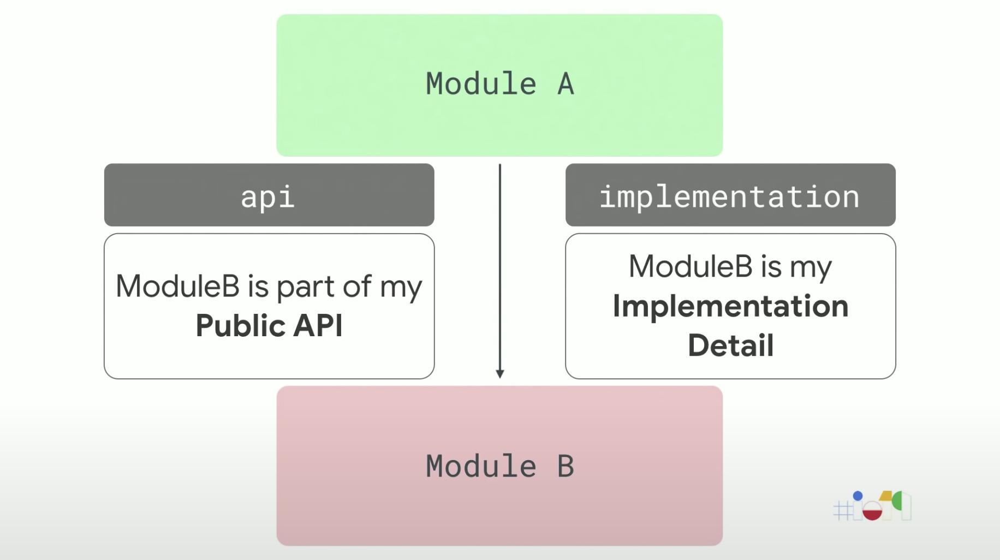

# Android地阶：模块化开发（一）——api与implementation


>前言：模块化开发系列旨在为读者建立起模块化的基本轮廓。


引入依赖库常用的有两种方式：
* api
* implementation

两者的区别，存在于传递依赖方面。


## implementation
该依赖方式所依赖的库不会传递。
```gradle
A implementation B
B implementation C
```
A无法使用C。

## api
该依赖方式会传递所依赖的库。
```gradle
A implementation B
B api C
```
A可以使用C。
