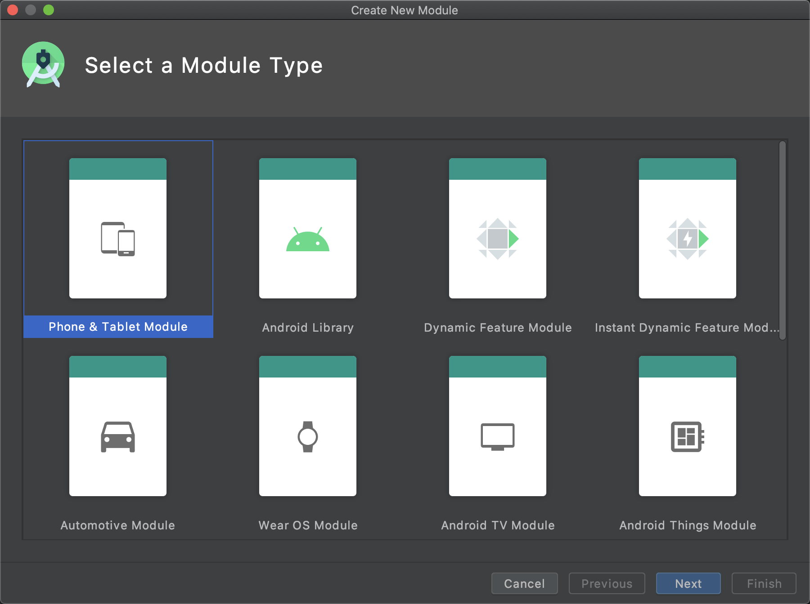
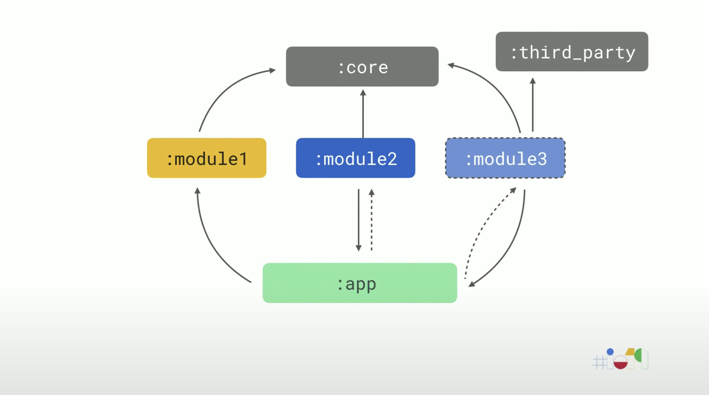
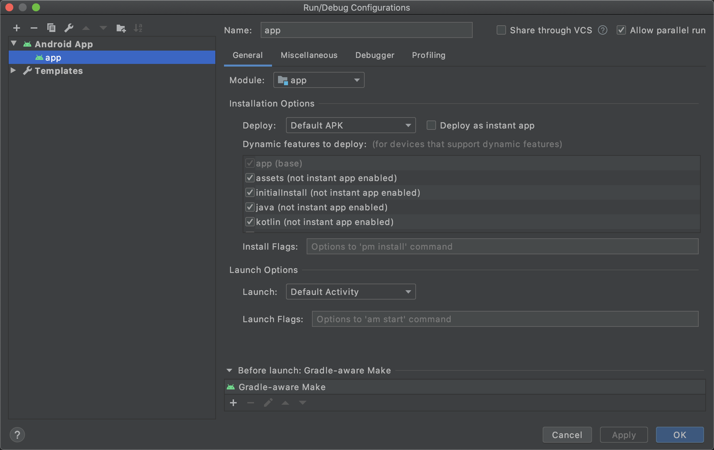

# Android模块化开发基础

# Module创建
使用Android Studio中的**File>New>New Module**创建Module



# Module类型
常用Module类型：
* Application
* Library
* Dynamic Delivery
* Instant Dynamic Delivery

Application为主模块，我们需要将Library和Dynamic Delivery引入Application。


## Aplication
Application为主模块，是应用运行的入口模块，其他的模块被引入Application发挥作用。

## Library
Library是普通的子模块，是任何情况下，都会打包进入Application的库，。

## Dynamic Delivery
Dynamic Delivery是按需引入的库，根据是否开启`onDemand`特性来决定是否引入。
`module2`的`AndroidManifest.xml`
```xml
<dist:module 
    dist:onDemand="false">
</dist:module>
```
`module2`的`onDamand="false"`，表示关闭按需引入，模块会打包进入apk。
`module3`的`onDamand=“true”`，表示开启按需引入，模块不会打包进入apk，会以第三方库（`:third_party`）的形式存在云端，在应用运行过程中根据需要额外下载。

## Core
`:module1`、`:module2`、`:module3`共同构成共享核心代码库。

## Instant Dynamic Delivery
图例中不包含Instant Dynamic Delivery，这是一种特殊的Dynamic Delivery。“Instant”直译为“瞬间”，你们记得应用商店里的快速启动App吗？Instant Dynamic Delivery写出来的Module就是它。

## 为什么要引入Dynamic Delivery？
80%的用户使用应用中20%的功能，这意味着你apk中打包的大部分功能对于大部分用户是闲置的，这就很浪费apk的大小空间。引入动态分发，就是为了将冗余的东西尽可能剔除，Library包含用户常用的20%的功能，剩余的模块交给Dynamic Delivery，在用户需要使用的时候再下载这些模块。

# Module标注
`:app`为Application，它的`build.gradle`
```gradle
apply plugin:'com.android.application'
```

`:module1`为Library,它的`build.gradle`使用
```gradle
apply plugin:'com.android.library'
```
`:module2`和`module3`为Dynamic Delivery，它们的`build.gradle`使用
```gradle
apply plugin:'com.android.dynamic-feature'
```

# Module引入
## Application引入Library
`:app`的`build.gradle`
```gradle
implemetation project(':module1')
```

## Application引入Dynamic Delivery
`:app`的`build.gradle`
```gradle
dynamicFeatures = [':module2', ':module3']
```

# Module运行
在**Run/Debug Configuration**的**Dynamic features to deloy**中选择动态添加的模块



