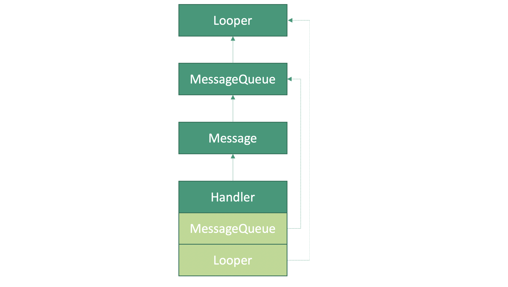
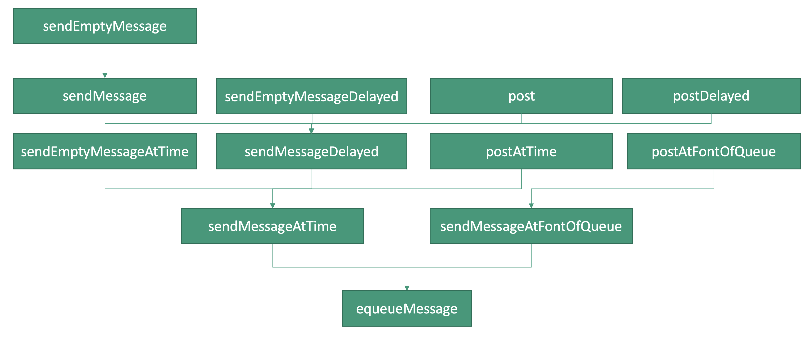
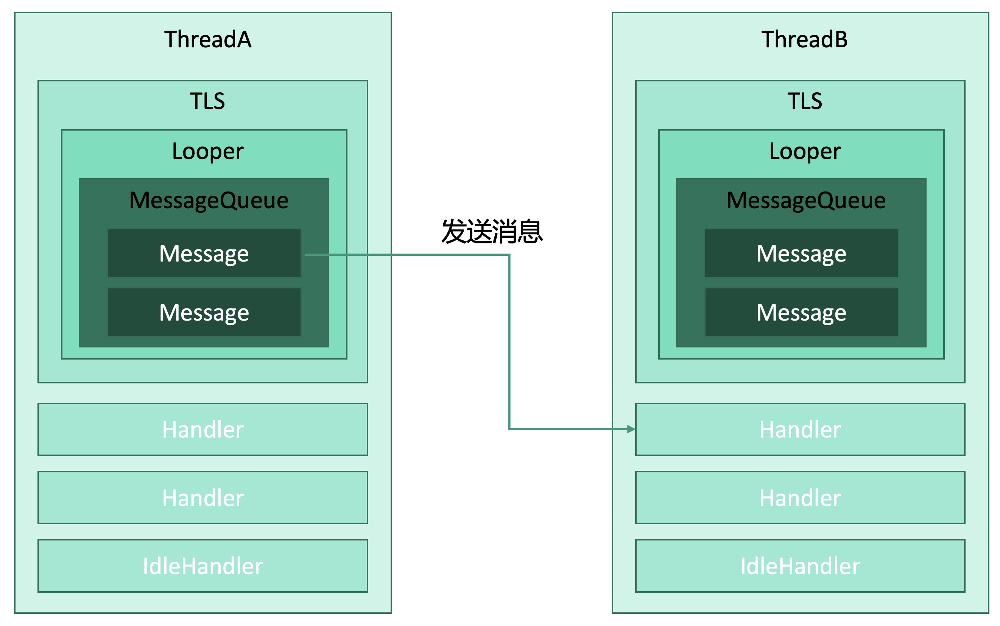
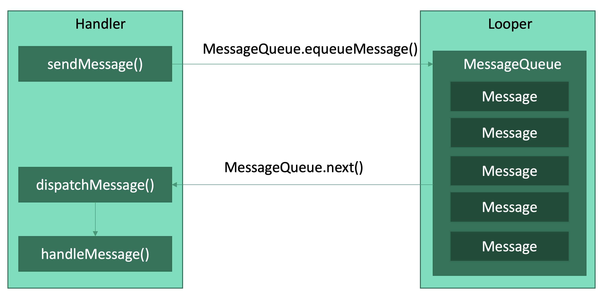

# Android消息机制（Java层）


## 基础示例

```java
// ExampleThread.java
public class ExampleThread extends Thread {
	public Handler mHandler;
  
  public void run() {
    Looper.prepare();
    mHandler = new Handler() {
      public void handleMessage(Message msg) {
        // TODO：处理消息
        switch(msg.what) {
          case ...: ...
          case ...: ...
        }
      }
    }
    Looper.loop()
  }
  
  public static void sendMessageToExampleThread() {
    Message msg = new Message()
    handler.sendMessage(msg)
  }
}
```


## 架构

`Handler.class`：持有Looper和Message。

```java
// Handler.java
public class Handler {
  final Looper mLooper;
  final MessageQueue mQueue;
}
```

```Message.class```:持有Handler

```java
// Message.java
public class Message {
  Handler target;
}
```

`MessageQueue.class`：持有Message。

```java
// MessageQueue.java
public class MessageQueue() {
  Message mMessages;
}
```

`Looper.class`：持有MessageQueue和Thread。

```java
// Looper.java
public class Looper() {
	final MessageQueue mQueue;
  final Thread mThread;
}
```



## Looper

### 准备

准备，在开始时，我们都会调用

```java
// ExampleThread.java
Looper.prepare()
```

代码为

```java
// Looper.java
public static void prepare() {
    prepare(true);
}
```

调用了`Looper.prepare(boolean quitAllowed)`

```java
// Looper.java
static final ThreadLocal<Looper> sThreadLocal = new ThreadLocal<Looper>();

private static void prepare(boolean quitAllowed) {
    // 如果ThreadLocal中已经有数据了，就抛出异常。
    if (sThreadLocal.get() != null) {
        throw new RuntimeException("Only one Looper may be created per thread");
    }
    // 创建Looper对象，并将其存储到当前线程的ThreadLocal
    sThreadLocal.set(new Looper(quitAllowed));
}


```


#### ThreadLocal

`ThreadLocal`：即Thread Local Storage，简称TLS，是每个线程的私有的本地存储区域。

`ThreadLocal.set()`：将数据存储到“当前线程”的TLS。

```java
// ThreadLocal.java
public void set(T value) {
    Thread t = Thread.currentThread();
    ThreadLocalMap map = getMap(t);
    if (map != null)
        map.set(this, value);
    else
        createMap(t, value);
}
```

`ThreadLocal.get()`：获取“当前线程”的TLS。

```java
// ThreadLocal.java
public T get() {
    Thread t = Thread.currentThread();
    ThreadLocalMap map = getMap(t);
    if (map != null) {
        ThreadLocalMap.Entry e = map.getEntry(this);
        if (e != null) {
            @SuppressWarnings("unchecked")
            T result = (T)e.value;
            return result;
        }
    }
    return setInitialValue();
}
```

然后再次回到这段代码

```java
private static void prepare(boolean quitAllowed) {
    // 如果ThreadLocal中已经有数据了，就抛出异常“每个线程只能创建一个Looper”。
    if (sThreadLocal.get() != null) {
        throw new RuntimeException("Only one Looper may be created per thread");
    }
    // 创建Looper对象，并将其存储到当前线程的ThreadLocal
    sThreadLocal.set(new Looper(quitAllowed));
}
```

第一次调用`Looper.perpare()`，当前线程的TLS为空，会执行`sThreadLocal.set(new Looper(quitAllowed))`来设置TLS，之后TLS不为空。这时，如果再次调用`Looper.prepare()`，会抛出异常。

也就是说每个线程只能执行一次`Looper.prepare()`。


#### new Looper()

我们在`sThreadLocal.set(new Looper(quitAllowed));`时需要创建一个`Looper`。这个创建过程为`Looper`创建了一个MessageQueue，并将Thread的引用指向当前线程。

```java
final MessageQueue mQueue;
final Thread mThread;

private Looper(boolean quitAllowed) {
    // 创建一个MessageQueue
    mQueue = new MessageQueue(quitAllowed);
    // 当前线程
    mThread = Thread.currentThread();
}
```


#### prepareMainLooper()

我们的主线程在运行的时候会自动调用`prepareMainLooper()`，并且创建的`Looper`为主`Looper`，不可退出。

因此，主线程中不需要工程师手动`Looper.prepare()`。

```java
// Looper.java
public static void prepareMainLooper() {
    // Looper不允许被退出
    prepare(false);
    synchronized (Looper.class) {
        // 不允许重复创建sMainLooper
        if (sMainLooper != null) {
            throw new IllegalStateException("The main Looper has already been prepared.");
        }
        // 将当前的Looper存储为sMainLooper
        sMainLooper = myLooper();
    }
}
```


> `Looper.prepare()`的主要工作是创建了一个带有`MessageQueue`并且指向“当前线程”的`Looper`，并将这个`Looper`存储到当前线程的TLS中。
>
> 每个线程想要调用`Looper`执行相关操作时，就必须执行`Looper.prepare()`来创建自己的`Looper`，否则连`Looper`都没有还怎么执行。其中，主线程在创建的时候已经自动执行了`prepareMainLooper()`并将`Looper`设置为不可退出，因此不需要工程师手动`Looper.prepare()`。


### 消息循环

消息循环，调用`Looper.loop()`

```java
// Looper.java
public static void loop() {
    // 获取当前线程存储在TLS中的Looper
    final Looper me = myLooper();
  	if (me == null) {
        throw new RuntimeException("No Looper; Looper.prepare() wasn't called on this thread.");
    }
    // 获取Looper中的MessageQueue
    final MessageQueue queue = me.mQueue;

    /** 
     * 接下来着两行代码不是很重要，别纠结
     * 主要作用就是loop的时候要进入某种状态
     * 所以做点状态上的准备并且记录一个令牌
     * 到时候根据这个令牌再恢复状态
     */
    // 清理掉调用线程，用本地线程的uid和pid替代
    Binder.clearCallingIdentity();
    // 记录恢复令牌
    final long ident = Binder.clearCallingIdentity();

    final int thresholdOverride =
            SystemProperties.getInt("log.looper."
                    + Process.myUid() + "."
                    + Thread.currentThread().getName()
                    + ".slow", 0);

    boolean slowDeliveryDetected = false;

    
    for (;;) {
        // 【重要】读取MessageQueue中的下一条信息
        Message msg = queue.next(); 
        if (msg == null) {
            // 【重要】如果MessageQueue中已经没有Message了，就结束loop()
            return;
        }

        // Debug日志打印，不重要...
        final Printer logging = me.mLogging;
        if (logging != null) {
            logging.println(">>>>> Dispatching to " + msg.target + " " +
                    msg.callback + ": " + msg.what);
        }
        
        // 观察者
        final Observer observer = sObserver;

        final long traceTag = me.mTraceTag;
        long slowDispatchThresholdMs = me.mSlowDispatchThresholdMs;
        long slowDeliveryThresholdMs = me.mSlowDeliveryThresholdMs;
        if (thresholdOverride > 0) {
            slowDispatchThresholdMs = thresholdOverride;
            slowDeliveryThresholdMs = thresholdOverride;
        }
        final boolean logSlowDelivery = (slowDeliveryThresholdMs > 0) && (msg.when > 0);
        final boolean logSlowDispatch = (slowDispatchThresholdMs > 0);

        final boolean needStartTime = logSlowDelivery || logSlowDispatch;
        final boolean needEndTime = logSlowDispatch;

        if (traceTag != 0 && Trace.isTagEnabled(traceTag)) {
            Trace.traceBegin(traceTag, msg.target.getTraceName(msg));
        }

        final long dispatchStart = needStartTime ? SystemClock.uptimeMillis() : 0;
        final long dispatchEnd;
        Object token = null;
        if (observer != null) {
            token = observer.messageDispatchStarting();
        }
        long origWorkSource = ThreadLocalWorkSource.setUid(msg.workSourceUid);
        try {
            // 【重要】向目标Handler分发消息
            msg.target.dispatchMessage(msg);
            if (observer != null) {
                // 【重要】向观察者分发消息
                observer.messageDispatched(token, msg);
            }
            dispatchEnd = needEndTime ? SystemClock.uptimeMillis() : 0;
        // 一堆异常处理，不重要...
        } catch (Exception exception) {
            if (observer != null) {
                observer.dispatchingThrewException(token, msg, exception);
            }
            throw exception;
        } finally {
            ThreadLocalWorkSource.restore(origWorkSource);
            if (traceTag != 0) {
                Trace.traceEnd(traceTag);
            }
        }
        // 一堆日志打印，不重要...
        if (logSlowDelivery) {
            if (slowDeliveryDetected) {
                if ((dispatchStart - msg.when) <= 10) {
                    Slog.w(TAG, "Drained");
                    slowDeliveryDetected = false;
                }
            } else {
                if (showSlowLog(slowDeliveryThresholdMs, msg.when, dispatchStart, "delivery",
                                msg)) {
                    slowDeliveryDetected = true;
                }
            }
        }
        if (logSlowDispatch) {
            showSlowLog(slowDispatchThresholdMs, dispatchStart, dispatchEnd, "dispatch", msg);
        }

        if (logging != null) {
            logging.println("<<<<< Finished to " + msg.target + " " + msg.callback);
        }

        // 恢复
        final long newIdent = Binder.clearCallingIdentity();
        if (ident != newIdent) {
            Log.wtf(TAG, "Thread identity changed from 0x"
                    + Long.toHexString(ident) + " to 0x"
                    + Long.toHexString(newIdent) + " while dispatching to "
                    + msg.target.getClass().getName() + " "
                    + msg.callback + " what=" + msg.what);
        }
				// 【重要】将Message放入消息池
        msg.recycleUnchecked();
    }
}
```

`Looper.loop()`中的无限循环，不断通过`Message msg = queue.next()`读取下一条消息，直到读完消息队列中所有消息为止。

每次循环，拿到`Message`后，开始分发消息：

* 给`Handler`分发消息：`msg.target.dispatchMessage(msg)`分发消息给`Message`的目标`Handler`。
* 给`Observer`分发消息：`observer.messageDispatched(token, msg)`分发消息给`Observer`。

分发完消息后会调用`msg.recycleUnchecked()`将利用完的`Message`放入消息池，以便**复用**。


### 退出

退出，调用`Looper.quit()`

```java
// Looper.java
public void quit() {
    // 调用MessageQueue中的quit()
    mQueue.quit(false);
}

// MessageQueue.java
void quit(boolean safe) {
    if (!mQuitAllowed) {
        throw new IllegalStateException("Main thread not allowed to quit.");
    }
    // 互斥：一个Looper在清空消息时，不允许其他Looper清空消息
    synchronized (this) {
        if (mQuitting) {
            return;
        }
        mQuitting = true;

        // 【重要】根据safe选择消息的退出方式
        if (safe) {
            // 如果安全，则移除尚未使用的消息
            removeAllFutureMessagesLocked();
        } else {
            // 如果不安全，则移除所有消息
            removeAllMessagesLocked();
        }

        nativeWake(mPtr);
    }
}
```

消息的退出方式：

* `safe==true`，安全，则移除尚未使用的消息。
* `safe==false`，不安全，则移除所有消息。

根据`Looper.quit()`的代码，`safe==false`，会移除所有所有消息。


### myLooper()

用于获取当前线程TLS中存储的`Looper`。

```java
// Looper.java
public static @Nullable Looper myLooper() {
    return sThreadLocal.get();
}
```


### myQueue()

用于从当前线程的`Looper`中获取`MessageQueue`。

```java
public static @NonNull MessageQueue myQueue() {
    return myLooper().mQueue;
}
```


## Message

### 成员变量

```java
// Message.java
public int what; // 消息标识
public int arg1; // 参数1
public int arg2; // 参数2
public Object obj; // 消息内容，传递任意数据
public long when; // 传递时间
public Messenger replyTo; // 跨进程访问的信使，我们这里是跨线程访问，因此暂不涉及
Bundle data; // 数据包，传递Bundle类型的数据包
Handler target; // 目标handler
Runnable callback; // 回调方法
Message next; // 下一条消息


int flags; // 状态
static final int FLAG_IN_USE = 1 << 0; // 正在被使用
static final int FLAG_ASYNCHRONOUS = 1 << 1; // 异步
static final int FLAGS_TO_CLEAR_ON_COPY_FROM = FLAG_IN_USE; // 如果消息正在清除或者复制，则设置状态为“正在被使用”

// 设置是否异步
public void setAsynchronous(boolean async) {
    if (async) {
        flags |= FLAG_ASYNCHRONOUS;
    } else {
        flags &= ~FLAG_ASYNCHRONOUS;
    }
}
```


#### 消息标识

what作为消息标识，`Handler`可以在拿到消息后根据`what`来分辨消息，从而进行特定的操作。

```java
mHandler = new Handler() {
  public void handleMessage(Message msg) {
    // 根据what做不同的操作
    switch(msg.what) {
      case 1: // 刷个牙
      case 2: // 洗个脸
    }
  }
}
```


#### 保留字

`arg1`和`arg2`是保留字段，arg1通常用来作为同步屏障SyncBarriar的token，后文`MessageQueue`会讲到。


#### 消息内容

`Object obj`和`Bundle data`都可以用来在`Message`存储内容，一般情况下用`Bundle data`，而`Object obj`仅作为保留手段。


#### 消息类型

* 普通消息：`target!=null`
  * 异步消息：`falgs`被设置为`FLAG_ASYNCHRONOUS`。
  * 同步消息：`falgs`未被设置为`FLAG_ASYNCHRONOUS`。

* 特殊消息：`target==null`
  * 同步屏障：SyncBarriar，

消息是否异步，通过`Message.setAsynchronous()`来设置消息是否异步，也通过`Message.isAsynchronous()`来查看消息是否异步。

同步屏障会挡在同步消息，不让同步消息穿过，而让异步消息穿过。也就是说在有同步屏障的情况下，异步消息优先执行，同步消息等所有异步消息完成之后再执行。详见后文`MessageQueue`的同步屏障。


### 消息复用

消息是Android中高频创建的对象，而创建对象需要消耗很多资源。因此，Google的工程师们构建了**消息池**，对消息进行复用。

消息使用完毕后，调用`Message.recycle()`，进而调用`recycleUnchecked()`回收消息。

```java
// Message.java
public void recycle() {
    if (isInUse()) {
        if (gCheckRecycle) {
            throw new IllegalStateException("This message cannot be recycled because it "
                    + "is still in use.");
        }
        return;
    }
    recycleUnchecked();
}

void recycleUnchecked() {
    // Mark the message as in use while it remains in the recycled object pool.
    // Clear out all other details.
    flags = FLAG_IN_USE;
    what = 0;
    arg1 = 0;
    arg2 = 0;
    obj = null;
    replyTo = null;
    sendingUid = UID_NONE;
    workSourceUid = UID_NONE;
    when = 0;
    target = null;
    callback = null;
    data = null;

    synchronized (sPoolSync) {
        if (sPoolSize < MAX_POOL_SIZE) {
            next = sPool;
            sPool = this;
            sPoolSize++;
        }
    }
}
```

`Handler`需要创建消息的时候，就调用`Handler.obtainMessage()`，进而调用`Message.obtain()`，先从消息池中拿曾经被回收的消息，如果消息池中没有消息再创建消息，以此达到节约资源的目的。

```java
// Handler.java
public final Message obtainMessage(...) {
	return Message.obtain(...);
}

// Message.java
public static Message obtain(...) {
	...
  return new Message();
}
```


## MessageQueue

消息队列，以`Message`为元素的队列，那就会有消息入队、下一条消息、消息出队等方法。

### 成员变量

```java
// MessageQueue.java
// 是否允许退出
private final boolean mQuitAllowed; 
// 是否正在退出
private boolean mQuitting; 
// 是否被阻塞
private boolean mBlocked; 

// Native层中的MessageQueue的指针
private long mPtr; 
// 指向MessageQueue的第一个元素
Message mMessages; 
// 用来保存Handler所在线程空闲时执行的的事务
// 当Handler所在的线程空闲时（MessageQueue中没有Message时），会执行这个数组中的事务
private final ArrayList<IdleHandler> mIdleHandlers = new ArrayList<IdleHandler>(); 
// 与Native层相关，暂不陈述
private SparseArray<FileDescriptorRecord> mFileDescriptorRecords; 
// 保存要被执行的IdelHandler
private IdleHandler[] mPendingIdleHandlers; 
// 下一个BarrierToken（同步屏障会用到，后文详解）
private int mNextBarrierToken;
```

关于队列的退出，我们刚开始说过Looper存储在线程中，而MessageQueue存储在Looper中，只要线程还活着，Looper一旦被线程创建就会无限循环运转，MessageQueue也会一直存在。那么MessageQueue退出的时候，也就说明Looper即将消亡，Looper即将消亡则意味着线程即将消亡。这时，如果我们发消息过去，则消息会被直接回收掉，在下面的“消息入队”中我们马上回看到。


### 消息入队

消息入队，调用`MessageQueue.enqueueMessage()`

```java
// MessageQueue.java
boolean enqueueMessage(Message msg, long when) {
    // 健壮性判断
    // 1.消息的handler不可为空，即只入队接收同步消息
    // 2.消息要未被使用
    if (msg.target == null) {
        throw new IllegalArgumentException("Message must have a target.");
    }
    if (msg.isInUse()) {
        throw new IllegalStateException(msg + " This message is already in use.");
    }

    synchronized (this) {
        // 【重要】如果队列正在退出（即线程即将消亡），则新到达的消息直接回收掉
        if (mQuitting) {
            IllegalStateException e = new IllegalStateException(
                    msg.target + " sending message to a Handler on a dead thread");
            Log.w(TAG, e.getMessage(), e);
            msg.recycle();
            return false;
        }
				// 标志消息“使用中”
        msg.markInUse();
        // 消息的传递时间
        msg.when = when;
        // p是MessageQueue的第一条消息，msg是即将入队的新消息
        // 如果p为空，则说明MessageQueue为空
        Message p = mMessages;
        // 是否需要唤醒队列
        boolean needWake;
        if (p == null || when == 0 || when < p.when) {
            // 如果MessageQueue为空，或者msg的传递时间是最早的，则直接处理
            // 下一条消息设置为新传入的消息
            msg.next = p;
            // MessageQueue的第一条消息设置为新传入的msg
            mMessages = msg;
            // MessageQueue的第一条消息更新，需要唤醒队列
            needWake = mBlocked;
        } else {
            // 【重要】如果MessageQueue不为空，则将msg按照传递时间顺序插入队列中
            // 通常情况下不需要唤醒队列，除非MessageQueue中第一条消息p是同步屏障并且新传来的消息msg是异步消息（代码段后我会解释）
            needWake = mBlocked && p.target == null && msg.isAsynchronous();
            // 后面就是简单的插入的代码（看不懂的买一本《数据结构》），不赘述
            Message prev;
            for (;;) {
                prev = p;
                p = p.next;
                if (p == null || when < p.when) {
                    break;
                }
                if (needWake && p.isAsynchronous()) {
                    needWake = false;
                }
            }
            msg.next = p; 
            prev.next = msg;
        }

        // 如果队列被唤醒了，就给Native层发个队列信号mPtr，Native层会做一些操作，暂不详述
        if (needWake) {
            nativeWake(mPtr);
        }
    }
    return true;
}
```

整体逻辑就是一个队列的插入：

* `MessageQueue`为空就直接插入，并被设置为第一个元素。
* `MessageQueue`不为空就根据传递时间的顺序，找到合适的地方插入队列。

学过《数据结构》的小伙伴肯定要吐槽了，你跟我说这东西叫“队列”？实际上它不是严格意义上的队列，而是一个有序单链表，其主要逻辑比较符合队列的特征：消息根据传递时间排好队，然后依次一件件处理。

有些情况下我们需要的唤醒队列：（建议回顾下`Message`中的消息类型，再来看这段解析）

* `MessageQueue`空，插入新消息，需要唤醒队列。因为队列为空，插入的新元素，无论有没有开启同步屏障同步消息还是异步消息，都可以执行。
* `MessageQueue`非空，插入异步消息、`MessageQueue`中第一条消息p是同步屏障并且新传来的消息`msg`是异步消息，需要唤醒队列。首先，`p.target == null`说明`MessageQueue`的第一条消息`p`是同步屏障，这说明开启了同步屏障机制，同步消息前会添加一个同步屏障阻止同步消息的执行，要在所有异步消息执行完毕后才能执行同步消息。而新传来的消息`msg`是异步消息，需要优先执行，因此需要唤醒线程来执行新消息`msg`。


### 下一条消息

下一条消息，调用`Looper.next()`。

```java
// MessageQueue.java
Message next() {
    // 当消息循环已经退出，则mPtr == 0，直接退出
    final long ptr = mPtr;
    if (ptr == 0) {
        return null;
    }

    // 待执行的IdleHandler的数量，也是IdleHandler[]的长度（可以先看Handler的时候会讲到，再回头看相关内容）
    int pendingIdleHandlerCount = -1; 
  	/**
     * 下一次轮询的倒计时
     * nextPollTimeoutMillis==-1：一直阻塞
     * nextPollTimeoutMillis== 0：不会阻塞，立即返回
     * nextPollTimeoutMillis > 0：最长阻塞时间为nextPollTimeoutMillis毫秒
     */
    int nextPollTimeoutMillis = 0;
    // 无限循环
    for (;;) {
        if (nextPollTimeoutMillis != 0) {
            Binder.flushPendingCommands();
        }
				// 【重要】阻塞，等待一定的时常后被唤醒
        nativePollOnce(ptr, nextPollTimeoutMillis);

        synchronized (this) {
            // 检索下一条消息，如果找到则将其返回
            final long now = SystemClock.uptimeMillis();
            Message prevMsg = null;
            Message msg = mMessages;
            
            //【重要】要求是普通消息
						// 如果消息的target为空，则说明开启了同步屏障机制，那就要优先找异步消息
            if (msg != null && msg.target == null) {
                // 优先寻找异步消息
                do {
                    prevMsg = msg;
                    msg = msg.next;
                } while (msg != null && !msg.isAsynchronous());
            }

            if (msg != null) {
                // 如果有消息
                if (now < msg.when) {
                    // 当前时间小于事件的触发时间时，说明还没轮到这个事件，则设置下一次轮训的倒计时为两者的时间差
                    nextPollTimeoutMillis = (int) Math.min(msg.when - now, Integer.MAX_VALUE);
                } else {
                    // 【重要】当前触发事件大于时间的触发时间时，说明已经轮到了，开始获取这条消息
                    // 取消消息队列的阻塞状态
                    mBlocked = false;
                    if (prevMsg != null) {
                        prevMsg.next = msg.next;
                    } else {
                        mMessages = msg.next;
                    }
                    
                    msg.next = null;
                    if (DEBUG) Log.v(TAG, "Returning message: " + msg);
                  	// 设置消息的使用状态为“使用中”
                    msg.markInUse();
                    // 返回这条消息
                    return msg;
                }
            } else {
                // 如果没消息，下一次轮询的倒计时设置为-1，即一直阻塞
                nextPollTimeoutMillis = -1;
            }

            // 如果MessageQueue正在退出，则返回null
            if (mQuitting) {
                dispose();
                return null;
            }

            // 准备开始执行IdleHandler
            // 先初始化IdleHandler[]，再执行IdleHandler[]中的任务。
            // 看看有没有待执行IdleHandler
            if (pendingIdleHandlerCount < 0
                    && (mMessages == null || now < mMessages.when)) {
                pendingIdleHandlerCount = mIdleHandlers.size();
            }
            // 如果没有待执行IdleHandler需要运行，则消息队列阻塞，持续循环等待
            if (pendingIdleHandlerCount <= 0) {
                mBlocked = true;
                continue;
            }
						// 如果IdleHandler为空，则创建一个IdleHandler
            if (mPendingIdleHandlers == null) {              
                mPendingIdleHandlers = new IdleHandler[Math.max(pendingIdleHandlerCount, 4)];
            }
            mPendingIdleHandlers = mIdleHandlers.toArray(mPendingIdleHandlers);
        }

        // 执行IdleHandler[]中的任务
        for (int i = 0; i < pendingIdleHandlerCount; i++) {
            final IdleHandler idler = mPendingIdleHandlers[i];
            mPendingIdleHandlers[i] = null; 

            boolean keep = false;
            try {
                keep = idler.queueIdle();
            } catch (Throwable t) {
                Log.wtf(TAG, "IdleHandler threw exception", t);
            }

            if (!keep) {
                synchronized (this) {
                    mIdleHandlers.remove(idler);
                }
            }
        }

        // 所有IdleHandler运行完毕后，pendingIdleHandlerCount为0。
        pendingIdleHandlerCount = 0;

        // IdleHandler处理完毕后，不经过等待，直接查询未处理的消息。
        nextPollTimeoutMillis = 0;
    }
}
```

基本逻辑：

* 先处理Handler中的消息，再处理IdleHandler中的事务。

* Handler消息处理时，如果开启了同步屏障机制，就要优先处理异步消息。

`nativePollOnce()`作为阻塞操作就涉及到`native`层的代码，留坑待填。


### 消息移除

移除消息，调用`Looper.removeMessages()`

```java
// MessageQueue.java
void removeMessages(Handler h, int what, Object object) {
    if (h == null) {
        return;
    }

    synchronized (this) {
        Message p = mMessages;

        // 消息队列从头到尾，移除所有符合条件的消息
        while (p != null && p.target == h && p.what == what
                && (object == null || p.obj == object)) {
            Message n = p.next;
            mMessages = n;
            // 回收到消息池
            p.recycleUnchecked();
            p = n;
        }

        // 移除剩余的符合条件的消息
        while (p != null) {
            Message n = p.next;
            if (n != null) {
                if (n.target == h && n.what == what
                        && (object == null || n.obj == object)) {
                    Message nn = n.next;
                    // 回收到消息池
                    n.recycleUnchecked();
                    p.next = nn;
                    continue;
                }
            }
            p = n;
        }
    }
}
```


### 同步屏障

同步屏障。如果开启同步屏障机制，就会优先处理异步消息。在同步消息前添加一个同步屏障，待异步消息处理完后，再执行同步消息。

例如下图的`MessageQueue`中，如果同步小消息执行顺序为“异步消息1”“异步消息2”，执行完后再执行“同步消息1”。具体的代码执行在`MessageQueue`中将详细讲解。


使用`postSyncBarrier()`向队列中发送同步屏障。

```java
// Looper.java
public int postSyncBarrier() {
    return postSyncBarrier(SystemClock.uptimeMillis());
}

private int postSyncBarrier(long when) {
    // barrier token入队，
    synchronized (this) {
        // barrier token累加，并记录到token中
        final int token = mNextBarrierToken++;
        // 从消息池中获取Message
        final Message msg = Message.obtain();
        // 标记这条消息“使用中”
        msg.markInUse();
        // 为消息赋值了when和token，token但是没有target，即target==null，因此这条消息是同步屏障
        msg.when = when;
        msg.arg1 = token;

        // 构造同步屏障后，将其插入到合适的地方
        Message prev = null;
        // MessageQueue的第一个消息
        Message p = mMessages;
        if (when != 0) {
            while (p != null && p.when <= when) {
                prev = p;
                p = p.next;
            }
        }
        if (prev != null) {
            msg.next = p;
            prev.next = msg;
        } else {
            msg.next = p;
            mMessages = msg;
        }
        return token;
    }
}

```

`Looper.removeSyncBarrier()`用于移除同步屏障。

```java
// MessageQueue.java
public void removeSyncBarrier(int token) {
    // barrier token出队
    synchronized (this) {
        Message prev = null;
        // MessageQueue的第一个消息
        Message p = mMessages;
        // 【重要】找到同步屏障：从消息队列中找到target==null并且token相等的Message，即为需要移出的同步屏障，将其移除。
        while (p != null && (p.target != null || p.arg1 != token)) {
            prev = p;
            p = p.next;
        }
        if (p == null) {
            throw new IllegalStateException("The specified message queue synchronization "
                    + " barrier token has not been posted or has already been removed.");
        }
        final boolean needWake;
        if (prev != null) {
            prev.next = p.next;
            needWake = false;
        } else {
            mMessages = p.next;
            needWake = mMessages == null || mMessages.target != null;
        }
        // 回收到消息池
        p.recycleUnchecked();

        if (needWake && !mQuitting) {
            nativeWake(mPtr);
        }
    }
}
```


### 连接Native层的桥梁

点一下，只需要知道`MessageQueue`与Native层关系密切，Native的章节会详细讲。

```java
// MessageQueue.java
MessageQueue(boolean quitAllowed) {
    mQuitAllowed = quitAllowed;
		// 初始化与native相关
    mPtr = nativeInit();
}

private void dispose() {
    if (mPtr != 0) {
        // 销毁与native相关
        nativeDestroy(mPtr);
        mPtr = 0;
    }
}

// 一堆与native相关的犯法
private native static long nativeInit();
private native static void nativeDestroy(long ptr);
private native void nativePollOnce(long ptr, int timeoutMillis); 
private native static void nativeWake(long ptr);
private native static boolean nativeIsPolling(long ptr);
private native static void nativeSetFileDescriptorEvents(long ptr, int fd, int events);
```


### IdleHandler

* `Handler`，处理消息。
* `IdleHandler`，只在线程空闲的时候执行一些业务逻辑，通常不是很紧要的任务

`IdleHandler`定义在`MessageQueue.java`中：

```java
// MessageQueue.java
public static interface IdleHandler {
    boolean queueIdle();
}
```

通过`MessageQueue.addIdleHandler()`来添加`IdleHandler`任务

```java
// MessageQueue.java
public void addIdleHandler(@NonNull IdleHandler handler) {
    if (handler == null) {
        throw new NullPointerException("Can't add a null IdleHandler");
    }
    synchronized (this) {
        mIdleHandlers.add(handler);
    }
}

```

通过`MessageQueue.removeIdleHandler()`来移除`IdleHandler`任务

```java
// MessageQueue.java
public void removeIdleHandler(@NonNull IdleHandler handler) {
    synchronized (this) {
        mIdleHandlers.remove(handler);
    }
}
```

使用示例

```java
// Example.java
MessageQueue messageQueue = Looper.myQueue();
    messageQueue.addIdleHandler(new MessageQueue.IdleHandler() {
      @Override
      public boolean queueIdle() {
        // TODO
        return false;
    }
});
```


## Handler

### 获取消息

前文有提到过，调用`Handler.obtainMessage()`进而调用`Message.obtain()`从消息池中获取消息。

```java
// Handler.java
public final Message obtainMessage(...) {
	return Message.obtain(...)
}
```


### 发送消息

最基础的`sendMessage()`系列

```java
public final boolean sendMessage(@NonNull Message msg) {
		return sendMessageDelayed(msg, 0);
}

public final boolean sendEmptyMessageAtTime(int what, long uptimeMillis) {
    Message msg = Message.obtain();
    msg.what = what;
    return sendMessageAtTime(msg, uptimeMillis);
}
...
```

用法

```java
Handler mHandler = new Handler(){
    @Override
    public void handleMessage(Message msg) {
       super.handleMessage(msg);
       switch(msg.what) {
           // TODO: Use the data from msg to do Something
       }
    }
};

new Thread(new Runnable() {
    @Override
    public void run() {
    	Message msg = new Message();
      msg.what = 1;
      handler.sendMessage(msg);
    }
});
```


最好用的`post()`系列

```java
public final boolean post(@NonNull Runnable r) {
  	return  sendMessageDelayed(getPostMessage(r), 0);
}

public final boolean postAtTime(@NonNull Runnable r, long uptimeMillis) {
		return sendMessageAtTime(getPostMessage(r), uptimeMillis);
}

public final boolean postDelayed(@NonNull Runnable r, long delayMillis) {
  	return sendMessageDelayed(getPostMessage(r), delayMillis);
}
...
```

用法

```java
Handler mHandler = new Handler();
String data = "data"
new Thread(new Runnable() {
    @Override
    public void run() {
        handler.post(new Runnable() {
            @Override
            public void run() {
                // TODO: Use data to do something
            }
        });
    }
}).start();
```


这些方法最终都是调用`MessageQueue.enqueueMessage()`，鉴于方法太多，这里汇总成一张图：




### 处理消息

在上文发送消息中其实演示过用法了，这里过一遍`handleMessage()`的源码。

```java
// Handler.java
// 回调函数的接口
public interface Callback {
   boolean handleMessage(@NonNull Message msg);
}

// handleMessage
public void handleMessage(@NonNull Message msg) {
	
}

// 分发消息
public void dispatchMessage(@NonNull Message msg) {
    if (msg.callback != null) {
        handleCallback(msg);
    } else {
        if (mCallback != null) {
            if (mCallback.handleMessage(msg)) {
                return;
            }
        }
        handleMessage(msg);
    }
}
```

我们通常在回调函数`Callback`中重写`handleMessage()`，然后`handleMessage()`中的代码会在`dispatchMessage()`中执行。


## 总结

总体架构的过程如图：



发送消息的过程如图：

`MessageQueue.euqueueMessage()`向`MessageQueue`中插入一个`Message`。

`MessageQueue.next()`从`MessageQueue`中提取一个`Message`。




## 


