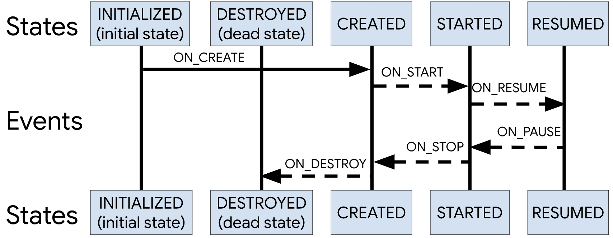
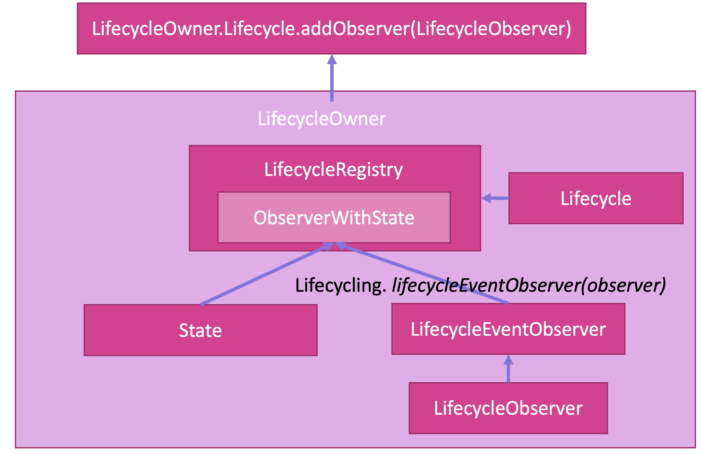

# Jetpack：生命周期组件


## 场景问题
我们在Android开发中会遇到这样一种场景：
```kotlin
class MainActivity: AppCompatActivity() {

    private val component1: Component1 = Component1()
    private val component1: Component2 = Component2()
    
    override fun onCreate(...) {
        component1.create()
        component2.create()
        component3.create()
    }
    
    override fun onStart(...) {
        component1.start()
        component2.start()
        component3.start()
    }
    
    override fun onResume(...) {
        component1.resume()
        component2.resume()
        component3.resume()
    }
    
    override fun onPause(...) {
        component1.pause()
        component2.pause()
        component3.pause()
    }
    
    override fun onStop(...) {
        component1.stop()
        component2.stop()
        component3.stop()
    }
    
    override fun onDistory(...) {
        component1.distory()
        component2.distory()
        component3.distory()
    }
}

class Component1 {
    
    fun create() {}
    fun start() {}
    fun resume() {}
    fun stop() {}
    fun distory() {}
    
}

class Component2 {
    
    fun create() {}
    fun start() {}
    fun resume() {}
    fun stop() {}
    fun distory() {}
    
}

class Component3 {
    
    fun create() {}
    fun start() {}
    fun resume() {}
    fun stop() {}
    fun distory() {}
    
}
```
组件的特定方法要在特定的生命周期进行调用，如果存在多个这样的组件，则生命周期方法中的代码就会非常冗杂。因此，Android对此进行控制反转，引入了**生命周期感应型组件**，通过绑定LifecyclerObserver和LifecyclerOwner来解决此类问题。

## LifecyclerOwner
带有生命周期的组件，例如Activity、Fragment，都持有`lifecycleOwner`。
不过`lifecycleOwner`是一个接口，他的表示类为`lifecycle`，你可以在组件的生命周期方法中获得`lifecycle`。
以Activity为例，他有
* `onCreate()`
* `onStart()`
* `onResume()`
* `onPause()`
* `onStop()`
* `onDistory()`

六大生命周期。我们可以通过`getLifecycle()`在这些生命周期方法中获得`lifecycle`。
```kotlin
MainActivity: AppCompatActivity() {
    private lateinit var mLifecycleOwner: LifecycleOwner
    
    onCreate() {
        mLifecycleOwner = lifecycle // 在kotlin中直接写lifecycle即表示getLifecycler()
    }
}
```

## LifeObserver
拿到`LifecycleOwner`后，我们获取他的`LifeCycle`为其添加观察者`LifecycleObserver`：
```kotlin
mLifecycleOwner.getLifecycle().addObserver(mLifecycleObserver)
```
观察者中的会随着```mLifecycleOwner```生命周期的变化而执行不同的方法。观察者是怎样做到这一点的呢？
* 实现```LifecycleObserver```接口
* 添加生命周期注解

```kotlin
MyObserver: LifecyclerObserver() {

    @OnLifecycleEvent(Lifecycle.Event.ON_CREATE)
    fun create() {}
    
    @OnLifecycleEvent(Lifecycle.Event.ON_START)
    fun start() {}
    
    @OnLifecycleEvent(Lifecycle.Event.ON_RESUME)
    fun resume() {}
    
    @OnLifecycleEvent(Lifecycle.Event.ON_STOP)
    fun stop() {}
    
    @OnLifecycleEvent(Lifecycle.Event.ON_DISTORY)
    fun distory() {}
}

```
每当```mLifecycleOwner```进入某一生命周期时，都会触发```mLifecycleObserver```中带对应的```@OnLifecycleEvent(Lifecycle.Event.xxx)```注解的函数。例如，当```mLifecycleOwner```进入```onCreate()```时，```mLifecycleObserver```会执行带有```@OnLifecycleEvent(Lifecycle.Event.ON_CREATE)```注解的方法。

## 代码总结
### 完整代码
我们把代码完整地写一遍：
```kotlin
MainActivity: AppCompatActivity() {
    private lateinit var mLifecycleOwner: LifecycleOwner
    private lateinit var mLifecycleObserver: LifecycleObserver
    
    onCreate() {
        // 获取MainActivity的lifecycleOwner
        mLifecycleOwner = lifecycle
        // 初始化lifecycleObserver
        mLifecycleObserver = MyObserver1()
        // 绑定两者
        mLifecycleOwner.addObserver(mLifecycleObserver)
        
        // 再来一遍
        mLifecycleOwner = lifecycle
        mLifecycleObserver = MyObserver2()
        mLifecycleOwner.addObserver(mLifecycleObserver)
        
        // 再来一遍
        mLifecycleOwner = lifecycle
        mLifecycleObserver = MyObserver3()
        mLifecycleOwner.addObserver(mLifecycleObserver)
    }
}

MyObserver1: LifecyclerObserver() {

    @OnLifecycleEvent(Lifecycle.Event.ON_CREATE)
    fun create() {}
    
    @OnLifecycleEvent(Lifecycle.Event.ON_START)
    fun start() {}
    
    @OnLifecycleEvent(Lifecycle.Event.ON_RESUME)
    fun resume() {}
    
    @OnLifecycleEvent(Lifecycle.Event.ON_STOP)
    fun stop() {}
    
    @OnLifecycleEvent(Lifecycle.Event.ON_DISTORY)
    fun distory() {}
    
}

MyObserver2: LifecyclerObserver() {

    @OnLifecycleEvent(Lifecycle.Event.ON_CREATE)
    fun create() {}
    
    @OnLifecycleEvent(Lifecycle.Event.ON_START)
    fun start() {}
    
    @OnLifecycleEvent(Lifecycle.Event.ON_RESUME)
    fun resume() {}
    
    @OnLifecycleEvent(Lifecycle.Event.ON_STOP)
    fun stop() {}
    
    @OnLifecycleEvent(Lifecycle.Event.ON_DISTORY)
    fun distory() {}
    
}

MyObserver3: LifecyclerObserver() {

    @OnLifecycleEvent(Lifecycle.Event.ON_CREATE)
    fun create() {}
    
    @OnLifecycleEvent(Lifecycle.Event.ON_START)
    fun start() {}
    
    @OnLifecycleEvent(Lifecycle.Event.ON_RESUME)
    fun resume() {}
    
    @OnLifecycleEvent(Lifecycle.Event.ON_STOP)
    fun stop() {}
    
    @OnLifecycleEvent(Lifecycle.Event.ON_DISTORY)
    fun distory() {}
    
}
```
这样，我们将原来的每个生命周期填写对应的方法的多次操作转化为一次性的绑定操作。

### 进一步优化
对于多个响应生命周期的组件，虽然我们通过上述方法避免了在每一个周期都写一次方法，但我们在一个周期内仍然要写很多**重复的绑定操作**，因此我们可以进一步优化，将绑定操作封装为函数`lifecycleBind`。
```kotlin
MainActivity: AppCompatActivity() {
    private lateinit var mLifecycleOwner: LifecycleOwner
    private lateinit var mLifecycleObserver: LifecycleObserver
    
    onCreate() {
        lifecycleBind(lifecycle, MyObserver1())
        lifecycleBind(lifecycle, MyObserver2())
        lifecycleBind(lifecycle, MyObserver3())
        ...
    }   
    
}

class Util {
    companion object {
        fun lifecycleBind(
            mLifecycleOwner: LifecycleOwner,
            mLifecycleObserver: LifecycleObserver
        ) {
            mLifecycleOwner.addObserver(mLifecycleObserver)
        }
    }
}
```

### 再进一步优化
我们解决了重复操作，但是仍然有一个问题，那就是要执行多个封装好的绑定函数。如果有99个组件，我就要写99行这样的代码。
我们发现在一个生命周期组件的绑定中，`LifecycleOwner`是固定的，而`LifecycleObserver`是不固定的。因此，我们可以建立`LifecycleObserver`数组，进行遍历操作。

```kotlin
MainActivity: AppCompatActivity() {
    private lateinit var mLifecycleOwner: LifecycleOwner
    
    onCreate() {
        
        // 一次获取LifecycleOwner
        val mLifecycleOwner = lifecycle
        // 建立LifecycleObserver数组
        val observers = listof( 
            MyObserver1(), 
            MyObserver2(), 
            MyObserver3() 
        )
        // 遍历绑定
        for(item in observers) {
            mLifecycleOwner.addObserver(mLifecycleObserver)
        }
    }   
    
}

class Util {
    companion object {
        fun lifecycleBind(
            mLifecycleOwner: LifecycleOwner,
            mLifecycleObserver: LifecycleObserver
        ) {
            mLifecycleOwner.addObserver(mLifecycleObserver)
        }
    }
}
```

## 状态检查
有时候我们需要检查当前的生命周期状态，以进行特定的操作。例如，你可能会在`Pause`状态更新一个UI的状态，然后在`Resume`状态再一次更新他。生命周期感知型组件对此引入了状态检查。
* 传入lifecycle
* 检查lifecycle的状态

```kotlin
MainActivity: AppCompatActivity() {
    private lateinit var mLifecycleOwner: LifecycleOwner
    private lateinit var mLifecycleObserver: LifecycleObserver
    
    onCreate() {
        mLifecycleOwner = lifecycle
        mLifecycleObserver = MyObserver(mLifecycleOwner)
        mLifecycleOwner.addObserver(mLifecycleObserver)
    }
    
    onResume() {
        // 检查状态并执行操作
        mLifecycleObserver.check()
    }
    
}

class MyObserver: LifecycleObserver(
    private val lifecycle: Lifecycle
) {
    
    fun check() {
        if(lifecycle.currentState.isAtLeast(Lifecycle.State.RESUMED) {
        // todo
        }
    }
}
```

## Event与State

生命周期中有两个枚举类，分别指向生命周期的事件和状态。
Event源码：
```kotlin
public enum Event {
        ON_CREATE,
        ON_START,
        ON_RESUME,
        ON_PAUSE,
        ON_STOP,
        ON_DESTROY,
        ON_ANY
}
```
State源码：
```kotlin
public enum State {
        DESTROYED,
        INITIALIZED,
        CREATED,
        STARTED,
        RESUMED;

        public boolean isAtLeast(@NonNull State state) {
            return compareTo(state) >= 0;
        }
    }
```
我们在之前的代码中都用过了，`Event`用作事件注解，`State`用作状态检查。大家可以结合图例整体把握一下。

## 源码分析
### getLifecycle()
我们分别来看Activity和Fragment的```getLifecycle()```
```java
// ComponentActivity.java
public Lifecycle getLifecycle() {
        return mLifecycleRegistry;
}

// Fragment.java
public Lifecycle getLifecycle() {
        return mLifecycleRegistry;
}
```
我们发现两者都返回了`mLifecycleRegistry`，这是什么呢？
```java
// ComponentActivity.java
private final LifecycleRegistry mLifecycleRegistry = new LifecycleRegistry(this);


// Fragment.java
LifecycleRegistry mLifecycleRegistry;

private void initLifecycle() {
        mLifecycleRegistry = new LifecycleRegistry(this);
        mSavedStateRegistryController = SavedStateRegistryController.create(this);
        if (Build.VERSION.SDK_INT >= 19) {
            mLifecycleRegistry.addObserver(new LifecycleEventObserver() {
                @Override
                public void onStateChanged(@NonNull LifecycleOwner source,
                        @NonNull Lifecycle.Event event) {
                    if (event == Lifecycle.Event.ON_STOP) {
                        if (mView != null) {
                            mView.cancelPendingInputEvents();
                        }
                    }
                }
            });
        }
    }
```

> `Build.VERSION.SDK_INT >= 19`可见对于Fragemnt的`Lifecycle`的操作，只有`SDK>=19`才会启用。

`mLifecycleRegistry`是`LifecycleRegistry`的实例。

```java
public class LifecycleRegistry extends Lifecycle {
    ...
}

public abstract class Lifecycle {
    ...
}
```
而`Lifecycle`是一个抽象类，`LifecycleRegistry`是`Lifecycle`的表现类。

由此可见，`LifecycleRegistry`表现了`Lifecycle`，而Fragment和Activity中获取到的`Lifecycle`都是`LifecycleRegistry`。但`Lifecycle`本身仅提供了Event和State的枚举类，对于`Lifecycle`主要的操作方法都在`LifecycleRegistry`中。当我们需要使用对`Lifecycle`的操作时，可以查看`LifecycleRegistry`寻找合适的方法。

### LifecycleOwner
LifecycleOwner只是一个接口，仅提供了`getLifecycle()`：
```kotlin
public interface LifecycleOwner {

    @NonNull
    Lifecycle getLifecycle();
}
```

### LifecycleObserver
LifecycleObserver更狠，一无所有：
```kotlin
public interface LifecycleObserver {

}
```

### 代码去哪儿啦？
你可能会很疑惑，代码去哪儿了？还记得刚才的`LifecycleRegistry`，没错，其实所有的逻辑代码都在这里。
查看`addObserver()`方法
```java
// LifecycleRegistry
@Override
public void addObserver(@NonNull LifecycleObserver observer) {
    State initialState = mState == DESTROYED ? DESTROYED : INITIALIZED;
    ObserverWithState statefulObserver = new ObserverWithState(observer, initialState);
    
}
```
然后我们通过`addObserver()`找到`ObserverWithState`：
```java
// LifecycleRegistry
static class ObserverWithState {
    State mState;
    LifecycleEventObserver mLifecycleObserver;

    ObserverWithState(LifecycleObserver observer, State initialState) {
        mLifecycleObserver = Lifecycling.lifecycleEventObserver(observer);
        mState = initialState;
    }  
}
```
我们看到了`LifecycleEventObserver`，打开源码：
```java
// LifecycleEventObserver
public interface LifecycleEventObserver extends LifecycleObserver {
    void onStateChanged(@NonNull LifecycleOwner source, @NonNull Lifecycle.Event event);
}
```
破案了，观察者`LifecycleObserver`通过`Lifecycling.lifecycleEventObserver()`获得`LifecycleEventObserver`实例，与状态`State`通过`ObserverWithState`捆绑实现了生命周期感知的主要逻辑。


## 逻辑图谱
奉上最后的逻辑图谱供读者参考。



