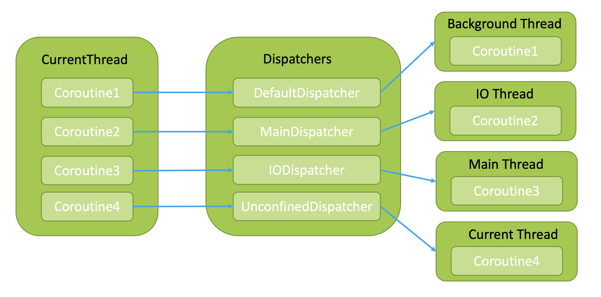
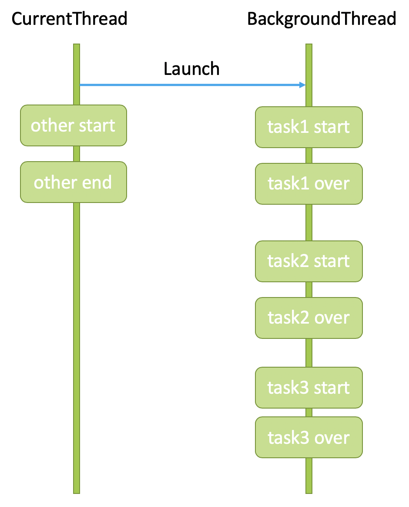
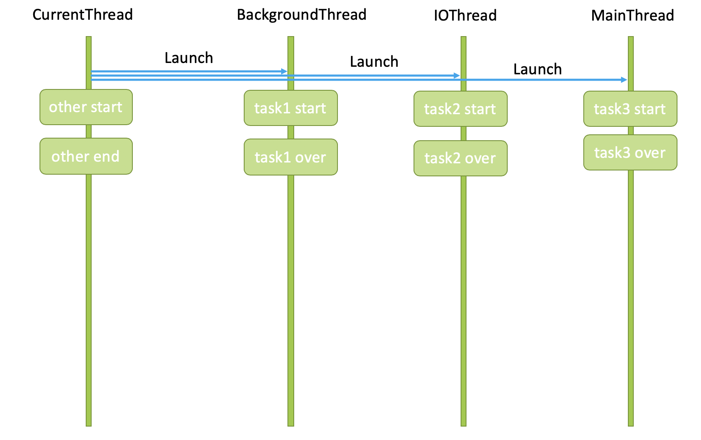
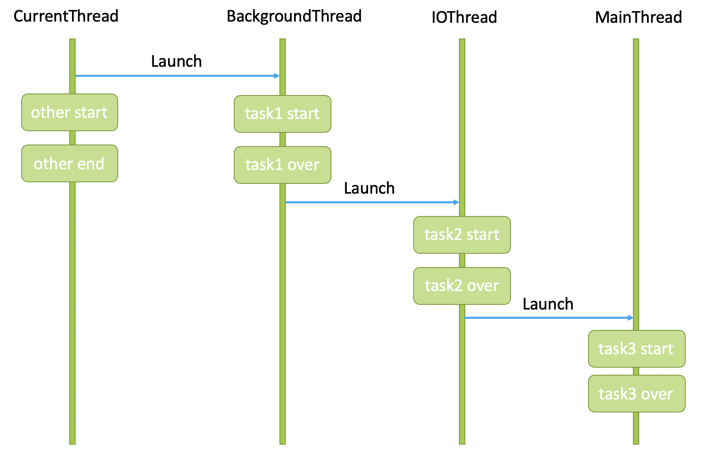
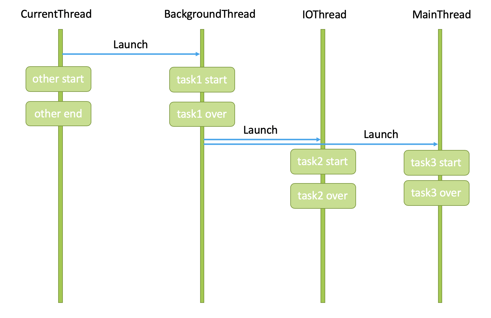
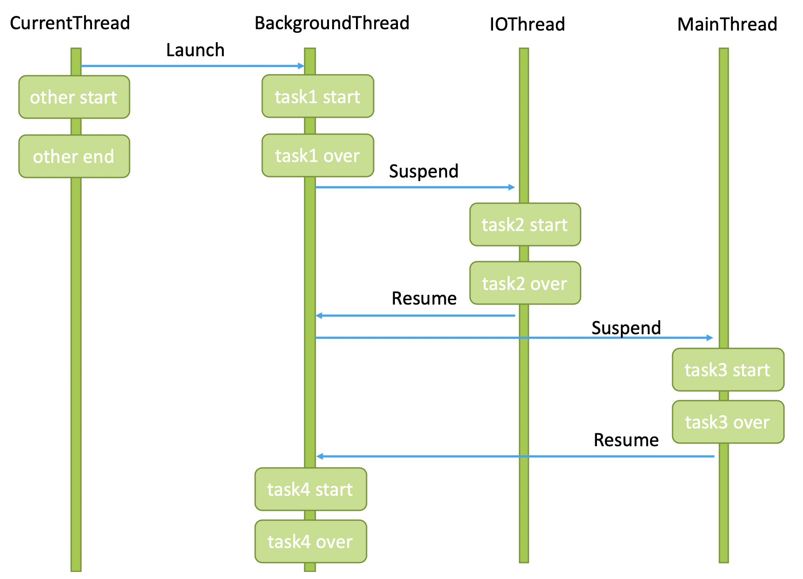

# Kotlin高级：协程


## 引言
Coroutine，一个线程框架，是建立在线程之上的API，用于让代码在各个线程之间反复横跳。
你只需要理解三个概念，就能理解协程：
* 调度器
* 挂起
* 并发

## 创建协程
协程创建格式
```
[CoroutineScope].[shift]([DisaptcherName]) {
    // 包内的代码称为协程
}
```
* CoroutineScope协程作用域
* LaunchWay运行方式
* DisaptcherName调度器名

首先，我们来创建一个协程
```kotlin
// Here are CurrentThread
CoroutineScope.lanuch(Dispatchers.Main) {
    println("Hello! Coroutine")
}
```
注意，
```
{
    println("Hello! Coroutine")
}
```
叫做**协程**，前面的`CoroutineScope.lanuch(Dispatchers.Default)`对协程而言，都只的参数。
这段代码做了什么呢？接下来这段话，请慢慢细读。
`CorutineScope.launch`是在`CurrentThread`里的执行的，它会让`CurrentThread`中开出一个新的协程
```
{
    println("Hello! Coroutine")
}
```
然后让调度器`Dispatchers`把这个协程调度到协程上下文`Main`所指代的线程中运行（`Main`指代主线程）。
这就提到我们第一个关键——**调度器**。

## 调度器
### 原理


协程调度器名有：
* `Dispatchers.Default` 
* `Dispatchers.Main` 
* `Dispatchers.IO` 
* `Dispactchers.Unconfined` 

分别对应协程调度器：
* `DefaultDisaptcher`
* `MainDispatcher`
* `IODispatcher`
* `UnconfinedDispatcher`

分别调度到线程：
* `BackgroundThread` 适合CPU密集型。
* `MainThread` 适合更新UI。
* `IOThread` 适合I/O与网络请求。
* `CurrentThread` 诶？你既然在当前线程了，直接写到当前线程下，不就好了吗？调度不是多此一举吗？注意，通过`UnconfinedDispatcher`调度过来的协程任务与普通的任务都区别在于，调度过来的任务会**立即执行**，且**阻塞当前线程**，只有调度过来的协程代码运行完，当前线程才会继续执行后续代码。

如图所示，我们在当前进程`CurrentThread`开出了多个协程`Corotine`，那么我们可以通过指定各个调度器名来指定使用对应的调度器，不同的调度器把协程调度到不同的线程上执行。
* 协程`Coroutine1`指定调度器名`Dispatchers.Default`，从而使用调度器`DefaultDisaptcher`将协程调度到`BackgroundThread`。
* 协程`Coroutine2`指定调度器名`Dispatchers.Main`，从而使用`MainDispatcher`将协程调度到`MainThread`。
* 协程`Coroutine3`指定调度器名`Dispatchers.IO`，从而使用`IODispatcher`将协程调度到`IOThread`。
* 协程`Coroutine4`指定调度器名`Dispactchers.Unconfined`，从而指定使用调度器`UnconfinedDispatcher`将协程调度到`CurrentThread`。

写成代码就是这样：
```kotlin
// Here are CurrentThread
CoroutineScope.launch(Disaptcher.Default) {
    // Coroutine1
}
CoroutineScope.lanuch(Disaptcher.Main) {
    // Coroutine2
}
CoroutineScope.lanuch(Disaptcher.IO) {
    // Coroutine3
}
CoroutineScope.lanuch(Disaptcher.Unconfined) {
    // Coroutine4
}
```

### 默认调度器
如果我们不写调度器，
```kotlin
// Here are CurrentThread
CoroutineScope.launch { // 第一处
    CoroutineScope.launch { // 第二处
    ...
    }
}
```
就会默认使用父协程的调度器，第一处会被调度到当前线程，第二处会使用**继承**第一处，也被调度到当前线程。


## 协程与线程
协程的运行方式分为两种：
* 非阻塞式——使用`launch`，不会卡住协程运行的线程。
* 阻塞式——使用`runBlocking`，会阻塞协程运行的线程。

### 非阻塞式
在理解了调度器之后，我们来对比两段代码
不使用协程：
```kotlin
// Here are CurrentThread
task1()
task2()
task3()
other()
```
使用协程：
```kotlin
// Here are CurrentThread
CoroutineScope.launch(Disaptcher.Default) {
    task1()
    task2()
    task3()
}
other()
```


后者的代码执行过程如图所示，通过`CoroutineScope.launch(Disaptcher.Default)`将协程
```kotlin
{
    task1()
    task2()
    task3()
}
```
切换到`BackgroundThread`执行，当前线程该干嘛就干嘛，继续执行`other()`，与协程内容互不相关。

>划重点：在协程被调度器调度到其他线程之后，协程就完全脱离当前线程，两者互不相关。

### 阻塞式
阻塞式使用`runBlocking`来运行协程代码
```kotlin
CoroutineScope.launch(Disaptcher.Default) {
    runBlocking {
        task1()
    }
    task2()
    task3()
}
other()
```
他是用来**霸占**线程的，当我们运行上述代码，协程被运送到`BackgroundThread`，这里的`runBlocking`没有指定调度器，因此**继承**了父协程的上下文，也被调度到了`BackgroundThread`（联系上文默认调度器），那么`runBlocking`马上就像强盗一样霸占了`BackgroundThread`直到自己的协程
```kotlin
{
    task1()
}    
```
完成，`BackgroundThread`才能执行其他代码。

### 分发到不同线程的执行顺序
刚才的代码，三个`task`都在同一个线程中运行，如果我想把他们放到不同的线程中运行呢？例如：
* `task1()`交给`DefaultDisaptcher`分发到`BackgroundThread`去执行。
* `task2()`交给`IODisaptcher`分发到`IOThread`去执行。
* `task3()`交给`MainDisaptcher`分发到`MainThread`去执行。


#### 第一种写法
你可能首先想到这样写
```kotlin
// Here are CurrentThread
CoroutineScope.launch(Disaptcher.Default) {
    task1()
    
}
CoroutineScope.lanuch(Disaptcher.IO){
    task2()
        
}
CoroutineScope.lanuch(Disaptcher.Main){
    task3()
}
```
它的执行顺序是这样的



#### 第二种写法
你可能会想到这样写
```kotlin
// Here are CurrentThread
CoroutineScope.launch(Disaptcher.Default) {
    task1()
    CoroutineScope.lanuch(Disaptcher.IO){
        task2()
        CoroutineScope.lanuch(Disaptcher.Main){
            task3()
        }
    }
}
other()
```
它的执行顺序是这样的


#### 第三种写法
你也可能想到这样写
```kotlin
// Here are CurrentThread
CoroutineScope.launch(Disaptcher.Default) {
    task1()
    CoroutineScope.lanuch(Disaptcher.IO){
        task2()        
    }
    CoroutineScope.lanuch(Disaptcher.Main){
        task3()
    }
}
other()
```
它的执行顺序是这样的


#### 第四种写法（推荐）
使用`withContext`，顾名思义，根据当前的协程上下文来运行。例如：
```kotlin
CoroutineScope.launch(Disaptcher.Default) {
    task1()
    withContext(Disaptcher.IO) { 
        task2()
    }
    withContext(Disaptcher.Main) { 
        task3()
    }
}
```
上述代码的协程上下文为`CoroutineScope`，则其中的`withContext`相当于`CoroutineScope.launch`。
那是不是最外层也使用？像下述代码这样？
```kotlin
// Here are CurrentThread
withContext(Disaptcher.Default) {
    withContext(...) { ... }
}
```
答：无法使用。
我们刚才说了，**根据当前协程上下文来运行**，写在最外层，没有协程上下文，因此无法使用。
>结论：```withContext```只能在协程中使用。

## 挂起
```kotlin
{
    // Here are CurrentThread
    CoroutineScope.launch(Dispatchers.Default) {
        task1()
        task2()
        task3()
        task4()
    }
    other()
}

fun task1() {
    println("task1")
}
suspend fun task2() {
    withContext(Dispatchers.IO) { 
        println("task2")
    }
}
suspend fun task3() {
    withContext(Dispatchers.Main) { 
        println("task3")
    }
}

fun task4() {
    println("task4")
}
```
首先，你想象自己拿着四封任务函，当前线程就是你的Boss。Boss只知道，首先去`Disaptcher.Default`窗口找`BackgroundThread`。于是指示你说：“去`Disaptcher.Default`窗口找`BackgroundThread`办理吧”。然后Boss就去处理`other()`任务，你则去处理这四封任务函。
我们到了`Disaptcher.Default`窗口排队，`BackgroundThread`看了看`task1()`，确认是自己的业务，就办完了并给`task1()`盖上终章。
但是`task2()`标明了`suspend`，表明要换一个窗口，但你并不知道要换哪一个，然后`BackgroundThread`拆开任务函，看到写着`Disaptcher.IO`，告诉你到`Disaptcher.IO`找`IOThread`办理，临走时他千叮咛万嘱咐，办理完了记得一定要回来找他，每张任务单都最后都需要第一个经手的业务人员盖章。你连连点头。
于是你暂时离开了`BackgroundThread`，`BackgroundThread`继续处理排在你后面的人的业务。而你又来到`Disaptcher.IO`窗口排队，`IOThread`看到`task2()`确实是自己的业务，就完成了，你赶紧回到了`Disaptcher.Default`找`BackgroundThread`，不过要重新排队。
终于轮到你了，`BackgroundThread`给`task2()`盖上终章，然后看了看你下一张任务单`task3()`标记着`suspend`，没错，又需要换个窗口，他又拆开任务函，看到写着`Disaptcher.Main`。他又指示你去`Disaptcher.Main`窗口找`MainThread`。临走前，他又嘱咐你办完后一定要回来。于是你又到`Disaptcher.Main`窗口找`MainThread`，`MainThread`完成了`task3()`。你赶紧回到了`Disaptcher.Default`窗口找`BackgroundThread`，不过又要重新排队。
终于轮到你了，`BackgroundThread`给`task3()`盖上终章，最后一个任务`task4()`没有`suspend`，`BackgroundThread`完成了`task4()`，并给`task4()`盖上了终章。
你的所有任务终于完成了！
这个过程如下

你每次离开`BakcgroundThread`都过程就叫`挂起Suspend`，也就是**暂时离开**，`BakcgroundThread`在你离开的期间会处理其他任务，而你办完事儿后要回到`BakcgroundThread`那里，这个回来的过程叫做`恢复Resume`。

> 相信学完挂起，你已经发现了协程存在的意义，他让本应通过各种“异步+回调”完成的代码用同步的方式写出来。

例如
```
requestName.callback {
    requestImage.callback {
        setInfo.callbakc{
            ...
        }
    }
}
```
这种**回调地狱**在协程中用同步的方式写出来，每一行可以看作是上一行的回调：
```kotlin
CoroutineScope.launch {
    requestName()
    requestImage()
    setInfo()
}

suspend fun requestName() {
    withContext(Dispatchers.IO) {
        ...
    }
}

suspend fun requestImage() {
    withContext(Dispatchers.IO) {
        ...
    }
}

suspend fun setInfo() {
    withContext(Dispatchers.Main) {
        ...
    }
}
```
而可以这么爽的原因，就是因为**挂起**和**恢复**。

## 并发
### async
再仔细看看上面那一段代码，有同学可能要问了，这个`requestName()`和`requestImage()`如果**没有依赖关系**，也可以并发进行呀！没错，协程也为各项任务提供了并发机制。
我们可以使用`async`来让协程并发工作。
```kotlin
CoroutineScope.launch {
    async { requestName() }
    async { requestImage() }
    setInfo()
}

suspend fun requestName() {
    withContext(Dispatchers.IO) {
        ...
    }
}

suspend fun requestImage() {
    withContext(Dispatchers.IO) {
        ...
    }
}

suspend fun setInfo() {
    withContext(Dispatchers.Main) {
        ...
    }
}

```
通过上述修改，`requestName()`和`requestImage()`就能并发工作了，两个并发任务启动（注意，不是执行完毕，是启动），立刻会执行`setInfo()`。

### await
有同学又要问了，万一你的`setInfo()`依赖`requestName()`和`requestImage()`的结果，那不会有问题了吗？
没错，所以这就需要我们的`await()`登场了。
```kotlin
CoroutineScope.launch {
    val result1 = async { requestName() }
    val result2 = async { requestImage() }
    setInfo(result1.await(), result2.await())
}

suspend fun requestName() {
    withContext(Dispatchers.IO) {
        ...
    }
}

suspend fun requestImage() {
    withContext(Dispatchers.IO) {
        ...
    }
}

suspend fun setInfo(String name, String img) {
    withContext(Dispatchers.Main) {
        ...
    }
}
```
我们为任务的执行结果添加上`await()`，协程就会等待并发任务执行完毕，再继续运行后续代码。

### 惰性并发
有时候我们可能并不希望我们的并发任务立刻执行，那么我们就需要运用惰性并发。
```kotlin
CoroutineScope.launch {
    val result1 = async(start = CoroutineStart.LAZY) { requestName() }
    val result2 = async(start = CoroutineStart.LAZY) { requestImage() }
    result1.await() // await()启动
    result2.start() // start()启动
    setInfo(result1, rsult2)
}

suspend fun requestName() {
    withContext(Dispatchers.IO) {
        ...
    }
}

suspend fun requestImage() {
    withContext(Dispatchers.IO) {
        ...
    }
}

suspend fun setInfo(String name, String img) {
    withContext(Dispatchers.Main) {
        ...
    }
}
```
我们通过`async (start = CoroutineStart.LAZY)`将任务变为惰性并发任务，惰性并发任务不会立刻运行，而是在两种情况下运行：
* `result`被`await()`，即其他任务需要他的结果时。
* `result`被`start()`，即我们手动启动它时。


