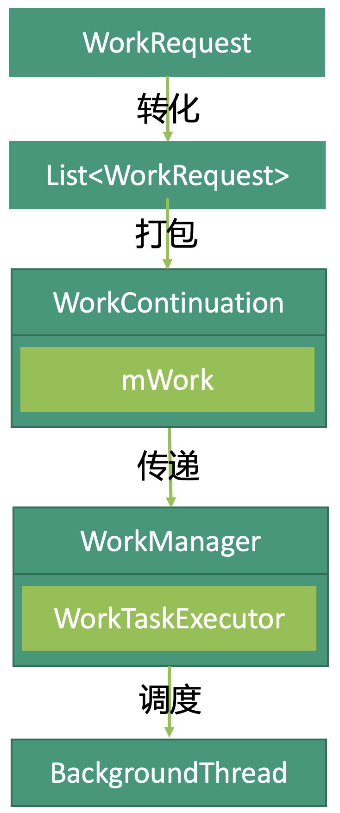

# WorkManager之添加任务

[TOC]

# 前言
Jetpack中的WorkManager用于管理后台运行的任务，可替代原先由Service执行的后台任务。

## 使用
### Gradle
gradle引入
```gradle
implementation "androidx.work:work-runtime-ktx:$work_version"
```

### Worker
实现`Worker`接口。
```kotlin
class MyWork(
    var appContext: Context,
    var workerParams: WorkerParameters
): Worker(appContext, workerParams) {

    override fun doWork(): Result {
        // TODO：执行任务的详细内容
        
        /**
          * 返回执行结果
          * 执行成功：Result.success()
          * 执行失败：Result.failure()
          * 稍后重试：Result.retry()
          */
        return Result.success()
    }

}
```


### WorkerRequest
运用`Worker`构造任务请求`WorkRequest`
```kotlin
/** 
  * WorkerRequest两种类型
  * OneTimeWorkRequest：一次性任务
  * PeriodicWorkRequest：周期性任务
  */
var myWorkRequest: OneTimeWorkRequest = OneTimeWorkRequestBuilder<MyWorker>().build()
```

### WorkerManager
将任务添加到`WorkerManager`的队列中
```kotlin
// 获取WorkManager实例（单例模式），并将任务添加到WorkManager的队列中
WorkManager.getInstance(context).enqueue(myWorkRequest)
```

## 进入队列源码解析
我们解析“添加任务”过程的源码。
```kotlin
WorkManager.getInstance(context).enqueue(myWorkRequest)
```
### 获取WorkManager实例
`WorkManager`是一个抽象类，我们在获取`WorkManager`实例的时候获取到的是它的实现类`WorkManagerImpl`：
```java
// WorkManager.java

// WorkManager获取实例的方法
public static @NonNull WorkManager getInstance(@NonNull Context context) {
    return WorkManagerImpl.getInstance(context);
}
```

### enqueue()添加任务请求
拿到实例后，我们将任务请求`WorkRequest`请求传入`enqueue()`方法，有两个主要的`enqueue()`方法：
* `WorkManager`中实现的`enqueue(@NonNull WorkRequest workRequest)`：用于添加一个任务请求。
* `WorkManagerImpl`中实现的`equeue(@NonNull List<? extends WorkRequest> workRequests)`：用于添加一组任务请求。

#### WorkManager中的enqueue()
```java
// WorkManager
@NonNull
public final Operation enqueue(@NonNull WorkRequest workRequest) {
    // 调用了下面的enqueue(@NonNull List<? extends WorkRequest> requests)
    return enqueue(Collections.singletonList(workRequest));
}

@NonNull
public abstract Operation enqueue(@NonNull List<? extends WorkRequest> requests);
```
可见，即便是添加一个任务请求`WorkRequest`，这个任务请求依然会被转化为任务请求列表`List<WorkRequest`，实际上执行的依然是`enqueue(@NonNull List<? extends WorkRequest> requests)`，而这个方法在`WorkManagerImpl`中被实现了。

#### WorkManagerImpl中的enqueue()
在`WorkManagerImpl`中我们实现了`enqueue(@NonNull List<? extends WorkRequest> requests)`，该方法执行了`WorkContinuationImpl`（即`WorkContinuation`的实现类）的`enqueue()`：
```java
// WorkManagerImpl.java
@Override
@NonNull
public Operation enqueue(
    @NonNull List<? extends WorkRequest> workRequests
) {

    ...
    return new WorkContinuationImpl(this, workRequests).enqueue();
}
```

#### WorkContinuation
我们并不清楚在`WorkContinuation`是什么，我们在`WorkContinuation.java`的头部注释看到这样的解释内容：
```java
/*
 * <pre>
 *     A       C
 *     |       |
 *     B       D
 *     |       |
 *     +-------+
 *         |
 *         E    </pre>
 *
 * you would write the following:
 *
 * <pre>
 * {@code
 *  WorkContinuation left = workManager.beginWith(A).then(B);
 *  WorkContinuation right = workManager.beginWith(C).then(D);
 *  WorkContinuation final = WorkContinuation.combine(Arrays.asList(left, right)).then(E);
 *  final.enqueue();}</pre>
 */
```
显而易见，`WorkContinuation`是用于任务排序用的。
在`WorkManagerImpl`中会首先构造`WorkContinuation`：
```java
 WorkContinuationImpl(
        @NonNull WorkManagerImpl workManagerImpl,
        @NonNull List<? extends WorkRequest> work) {
    this(
        workManagerImpl,
        null,
        ExistingWorkPolicy.KEEP,
        work, // 传入List<WorkRequest>
        null
    );
}
```
调用了以下构造方法：
```java
WorkContinuationImpl(
    @NonNull WorkManagerImpl workManagerImpl,
    String name,
    ExistingWorkPolicy existingWorkPolicy,
    @NonNull List<? extends WorkRequest> work,
    @Nullable List<WorkContinuationImpl> parents
) {
    mWorkManagerImpl = workManagerImpl;
    mName = name;
    mExistingWorkPolicy = existingWorkPolicy;
    // List<WorkRequest>最终被传入mWork
    mWork = work;
    mParents = parents;
    mIds = new ArrayList<>(mWork.size());
    mAllIds = new ArrayList<>();
    if (parents != null) {
        for (WorkContinuationImpl parent : parents) {
            mAllIds.addAll(parent.mAllIds);
        }
    }
    for (int i = 0; i < work.size(); i++) {
        String id = work.get(i).getStringId();
        mIds.add(id);
        mAllIds.add(id);
    }
}
```
我们传入的`WorkRequest`最终被传递到`WorkContinuation`的`mWork`这个队列中。
构造完成后，执行`WorkContinuation`中的`enqueue()`：
```java
@Override
public @NonNull Operation enqueue() {
    
    ...
    if(!mEnqueued) {
    EnqueueRunnable runnable = new EnqueueRunnable(this);
    mWorkManagerImpl
        .getWorkTaskExecutor()
        .executeOnBackgroundThread(runnable);
    mOperation = runnable.getOperation();
    } else {
        ...
    }
    return mOperation;
}
```
他调用了`WorkManagerImpl`中的任务执行器`WorkTaskExecutor`将我们传入的任务调到后台线程中执行。
```java
mWorkManagerImpl
        .getWorkTaskExecutor()
        .executeOnBackgroundThread(runnable);
```


### 总结
* `Worker`定义任务内容，`WorkerRequest`定义任务请求，`WorkerManager`管理任务的执行，`WorkContinuation`管理任务的顺序。
* 无论是添加一个任务请求`Workquest`还是一组任务请求`List<WorkRequest>`，执行的都是`WorkManagerImpl`中添加一组任务请求的方法`enqueue(@NonNull List<? extends WorkRequest> requests)`。
* 任务最终会被`WorkManagerImpl`中的`WorkTaskExecutor`调用到后台线程中执行。

代码的主体逻辑如下：



