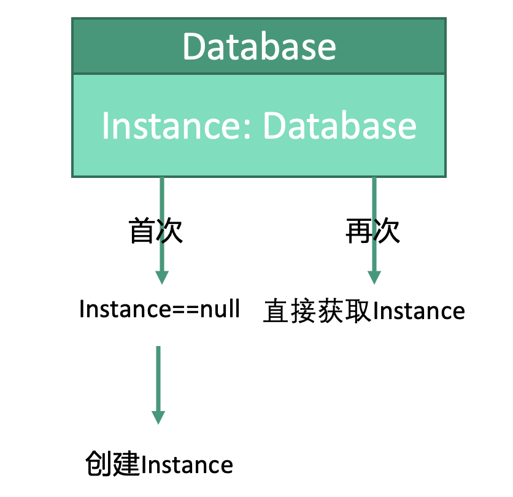

# 创建型：单例模式


## 释义
单例模式，对象仅保持一个实例，并且这个实例由自己创建。通常这个实例是静态变量，创建实例的方法为静态方法。

最直观的例子：数据库对象，创建费时费力，但是复用性很高。因此我们对于数据库对象可以使用单例模式，在首次获取实例时创建实例，后续获取实例则直接返回已存在的实例。

## 自我实例化
```kotlin
class Database() {
    
    companion object {
        private var instance: Database? = null
        
        fun getInstance(): Database {
            // 如果实例未被创建，则创建，否则直接返回已经存在的实例
            if(instance == null) {
                instance = Database()
            }
            return instance
        }
    }
    
}
```

## 使用
```kotlin
fun main() {
    // 首次使用会创建实例
    val database1 = Database.getInstance()
    // 再次使用直接返回已存在的实例
    val database2 = Database.getInstance()
}
```

