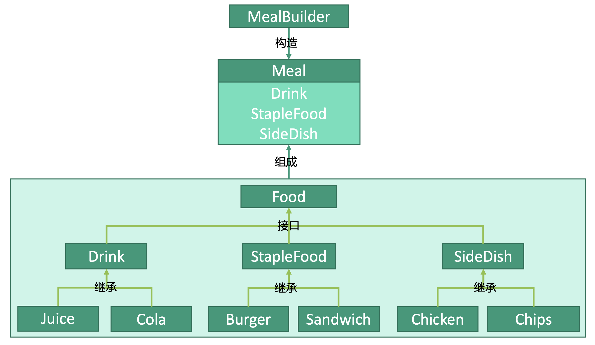

# 创建型：建造者模式


## 建造者模式
建造者模式，如果一个对象很复杂，我们可以将其分割为各个子类，逐步构造子类，最后完成这个对象的构造，这个过程就像建筑师在建造房子时逐步添砖加瓦的过程。

快餐店出售食品Food，食品的菜单是这样的：
* 饮料Drink
    * 果汁Juice
    * 可乐Cola
* 主食StapleFood
    * 汉堡Burger
    * 三明治Sandwich
* 配菜SideDish
    * 鸡肉Chicken
    * 薯条Chips
    
不过快餐店更希望将这些单品打包成套餐Meal进行出售，所以他们把菜单改成了这样：
* 套餐A 果汁Juice+汉堡Burger+鸡肉Chicken
* 套餐B 可乐Cola+三明治Sandwich+薯条Chips


## 套餐Meal
```kotlin
class Meal {
    val drink: Drink
    val stapleFood: StapleFood
    val sideDish: SideDish
}
```
## 套餐打包器MealBuilder
```kotlin
class MealBuilder {

    fun buildMealA() {
        val meal: Meal = Meal()
        meal.drink = Juice()
        meal.stapleFood = Burger()
        meal.sideDish = Chicken()
        return meal
    }
    
    fun buildMealB() {
        val meal: Meal = Meal()
        meal.drink = Cola()
        meal.stapleFood = Sandwich()
        meal.sideDish = Chips()
        return meal
    }
}
```

## 使用
```kotlin
fun main() {
    val mealA = MealBuilder().buildMealA()
    val mealB = MealBuilder().buildMealB()
}
```
