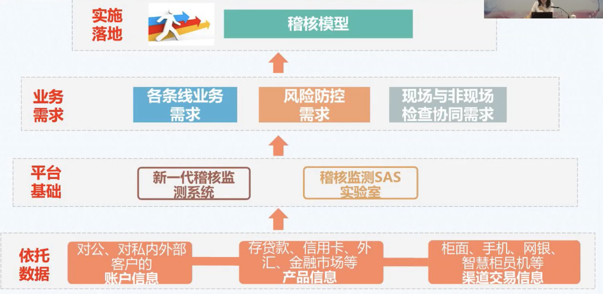
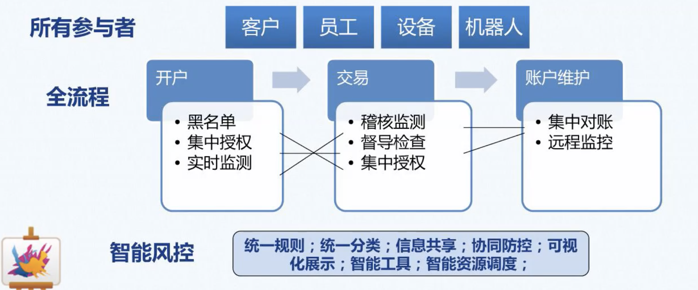
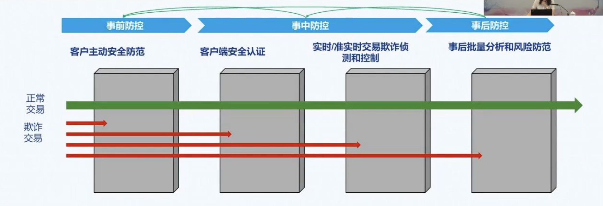
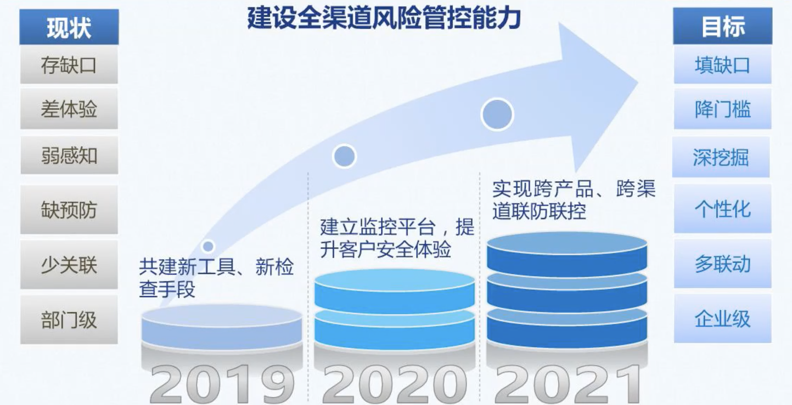

# 稽核业务介绍

[中国建设银行浙江省分行2020年“在云端·遇建未来”新入职员工培训](https://u.ccb.com/livehome/#/liveintroduction?id=65590c3b-548a-4198-bc94-8667e52e185a)

## 业务发展历史沿革

* 条线稽核阶段
* 集中稽核阶段
* 重点稽核阶段：电子化，具备一定省级能力
* 分类作业阶段：真正实现省级能力
* 风险导向阶段：营运稽核系统和柜面业务检测系统
* 大数据稽核阶段
  * 新一代稽核系统
  * 2100+稽核模型
  * 539数据原表
  * 稽核检测SAS实验室

## 稽核业务分类

* 核对类稽核（武汉、成都两个分中心处理，浙江在武汉中心）
  * 凭证要素审核
  * 总行
* 分析性稽核
  * 风险预警分析处理
  * 省行
* 专题业务稽核
  * 专项深入分析
  * 总、分行，按季实行

## 稽核模型

### 分类

按照作业方式分类：

* 分析类模型（最多）
* 核对类模型（较多）
* 服务提醒类模型（较多）（临时卡到期提醒、网点内部轮岗时间提醒）
* 实时类模型（中等）（交易码为出发点，目标为客户在场情况下处理掉）
* 业务管理类模型（中等）
* 制定监控类模型（最少）

按照关注对象分类：

* 操作差错类
* 关注员工类
* 风险行为类
* 操作监测类

## 稽核问题

### 分类

按照成因和主体分类：

* 系统缺陷与制度漏洞
* 柜员违规操作
* 客户违法违规交易

按照严重程度分类：

* 轻微违规
* 一般违规
* 严重违规

## 稽核结果利用

* KPI考核
* 全面风险管理评价
* 渠运条线考核

重要案例：红黑榜

## 稽核预警

### 基本预警流程

查阅凭证分析正常后则结束

若有问题下发网点核查，网点核查后回复

若网点回复后还是觉得有问题，可以继续要求网点查或者直接开立问题

开立问题后，网点仍然有解释的机会，由问题管理员（与作业人员不是同一个人）确认

如果最终认定有问题，网点可以申请“复审”：

支行审了有问题，网点不服，继续向分行申请“复审”

分行审了有问题，网点不服，继续向省行申请“复审”

省行审了有问题，网点不服，继续向总行申请“复审”

### 岗位设置要求

稽核检测信息核查岗，由网点营运主管、高级桂圆、网点负责人担任

无权核查处理本人经办业务

### 预警信息核查与反馈

预警级别：

* 风险行为：可能存在重大违规表现，反馈失效3小时
* 关注员工：存在违规表现，反馈失效18小时
* 操作差错：存在不合规问题，反馈失效48小时

### 问题核查与反馈

* 轻微违规问题：三日内
* 一般违规问题：两日内
* 严重违规问题：一日内

### 稽核问题认定标准

《分析性稽核核查操作指引》

真实性、合理性、逻辑性

> 配合稽核人员解决问题，不要总想着逃避狡辩，不然观感很不好，会有负面影响。

## 延伸小知识

### 网点会计凭证上交流程

COS_T和集中授权业务：

=>**前台扫描**并产生电子影像

=>柜员实物凭证整理封包

=>集中扫描点

=>会计凭证入库

需后台扫描的业务及分行特色业务：

=>柜员实物凭证整理封包

=>集中扫描点

=>**后台扫描**

=>会计凭证归档入库并产生电子影像

> 可能后面会全转到后台扫描

## 稽核模型应用

稽核最重要的就是稽核模型，稽核模型是稽核的生命力

### 稽核模型的研发

* 模型需求提出
  * 各条线提出业务需求
  * 根据**风险案例**研发
* 模型分析配置
  * 模型可行性分析
  * SAS数据验证
* 系统发布运行
  * 通过测试后由总行发布
* 后期优化维护
  * 模型异常处理
  * 根据制度变化情况进行优化或停用

> ATM机上限为120万元

### 柜面风险点——个人客户身份识别

* 分析类
  * 存款账户开户长期身份证有效期维护错误
  * 存款账户错用户口簿开户
  * 存款账户开户身份信息与实际不符
  * 结售汇交易身份未核查
  * 电子渠道签约身份证未核查
* 服务提醒类
  * 存款国籍错误账户发生交易
  * 存款账户军警证件超期使用
  * 存款账户同一户名不同证件号开户
* 业务管理类
  * 涉敏国家客户可疑交易
  * 涉敏国家客户国籍变更
  * 涉敏国家客户开户预警

### 柜面风险点——非营业时间

* 个人贵金属非营业时间提取
* 柜员非营业时间现金交易
* 柜员非营业时间客户信息查询
* 柜员非营业时间现金调拨
* 自助设备非营业时间现金调拨
* 柜员非营业时间现金冲正

### 柜面风险点——自助设备监控

* 尾箱管理
  * 尾箱余额红字
  * 长期未用尾箱余额非零
  * 尾箱未及时封存
* 清机调拨
  * 疑似重复调拨
  * 频繁现金调拨
  * 未按期清机维护
* 增加标题
  * 长短款挂帐未及时销账
  * 大额现金长款挂帐
  * 长款挂帐90天后转个人

### 稽核模型案例：快贷资金流入股市

情况：快贷资金不允许流入股市与房地产，但是仍然有客户通过资金周转等方式进行操作。

稽核：下发书面提示，要求二级分行加强信贷资金流向等监控管理，对违规资金流向及时进行清收处置。

### 稽核模型案例：司法冻结

情况：柜员在实际工作中，将客户资金冻结，但是没有输入解冻日期，而默认的解冻日期为当日，相当于冻结无效。

稽核：签发稽核业务提示，提示柜面按照法律文书中规定的解冻日期录入。

## 稽核大数据应用趋势

### 员工高风险行为精准画像

* 业务场景：审计联动，研究设计数据模型
* 差异化分析：针对员工岗位特点差异化分析，建立风险样本进行持续跟踪
* 账户疑点
* 前瞻预判：多维度量化分析和评价画像
* 群体：网点负责人、柜面交易人员、客户经理

### 服务全行工作重点——快贷

三大战略：住房租赁 金融科技 普惠金融

快贷属于普惠金融

通过“借款人主体资格”“贷款资金流向”“贷前、贷后管理难点”进行大数据分析，排查风险。

### 智能运营风控体系

### 稽核数据可视化

