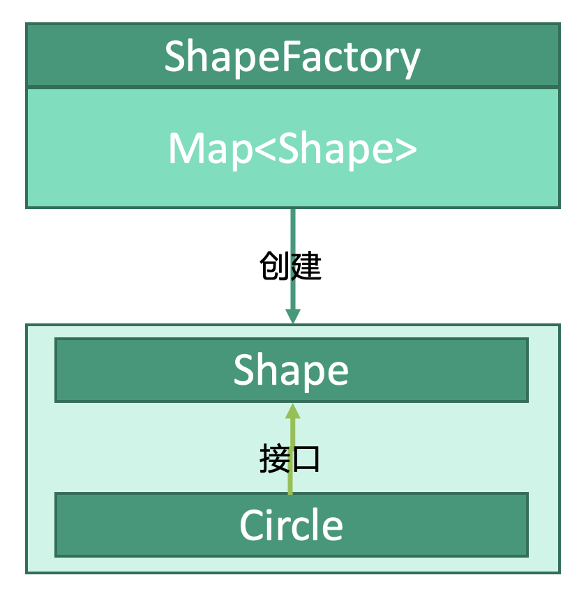

# 结构型：享元模式


## 释义
享元模式，“元”即某个属性，“享元”即共享属性。如果计划创建的对象有某个属性值与已存在的实例相同的话，则共享这个属性，即直接用这个实例而不是重新创建。

`ShapeFactory`创建`Shape`，如果计划创建的`Shape`的某个属性和`Map<Shape>`中已经存在某个实例相同，则直接取用`Map<Shape>`中的那个`Shape`。

## 基础类
```kotlin
interface Shape {
    fun draw()
}

class Circle(
    var color
) : Shape {
    override fun draw() {
        drawCircle()
    }
}
```

## 工厂类
```kotlin
class ShapeFactory {
    private val circleMap: MutableMap<String, Shape> = mutableMapOf()
    
    fun getCircle(color: String) {
        // 查找Map中有没有相同color的Circle
        var circle: Circle = circleMap.get(color) as Shape
        // 如果没有则创建新的Circle
        if(circle == null) {
            circle = Circle(color)
            // 添加到Map中
            circle.set(color, circle)
        }
        
        return circle
    }
}
```

## 使用
```kotlin
fun main() {
    val red: String = "Red"
    
    val shapeFactory: ShapeFactory = ShapeFactory()
    
    // 第一次circleMap中还没有color为Red的，因此会创建
    val circle1 = shapeFactory.getCircle("Red") 
    // 第二次circleMap中已经有color为Red的circle，会直接从circleMap中获取
    val circle2 = shapeFactory.getCircle("Red") 
}
```
