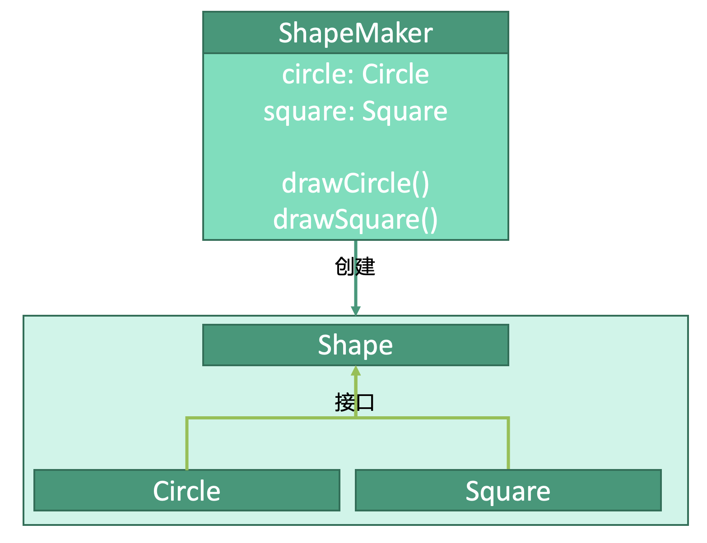

# 结构型：代理模式


## 释义
外观模式，隐藏内部逻辑的复杂性，仅提供接口供客户端访问，这些接口就是“外观”。

`ShapeMaker`是为客户端提供的接口，`Circle`和`Square`接入`Shape`。客户端通过`ShapeMaker`中的各种接口在`ShapeMaker`中创建`Shape`的各种实例并调用实例的方法。

## 基础类
```kotlin
interface Shape {
    fun draw()
}

class Circle : Shape {
    override fun draw() {
        drawCircle()
    }
}

class Square : Shape {
    override fun draw() {
        drawSquare()
    }
}
```

## 接口
```kotlin
class ShapeMaker( 
    // 包含的Shape类
    private var circle : Circle
    private var square : Square
) {
    // 向客户端提供接口
    public fun drawCircle() {
        circle.draw()
    }
    
    public fun drawSquare() {
        square.draw()
    }
}
```

## 使用
```kotlin
fun main() {
    val circle: Circle = Circle()
    val square: Square = Square()
    
    val shapeMaker: ShapeMaker = ShapeMaker(circle, square)
    // 调用接口
    shapeMaker.drawCircle()
    shapeMaker.drawSqaure()
}
```


