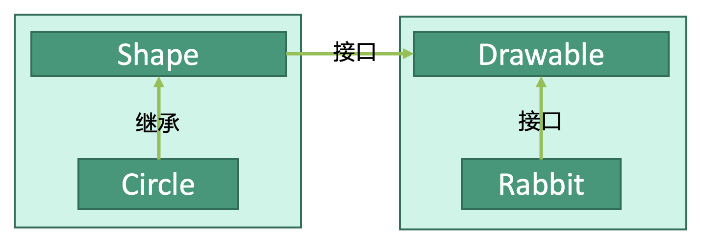

# 结构型：桥接模式


## 释义
桥接模式，在类的基础上，增加一个接口作为“桥”。接口的实现类和该类都可以独立变换而互不影响。

对于抽象类`Shape`，为他接入接口`Drawable`。`Circle`是抽象类`Shape`的实现类，`Rabbit`是接口`Drawable`的实现类。`Circle`和`Rabbit`可以互不干扰、独立实现。


## 桥
```kotlin
interface Drawable {
    fun draw()
}
```


## 基础类
```kotlin
abstract class Shape : Drawable{
    override fun draw()
    
    fun show()
}
```

## 桥的实现类
```kotlin
class Rabbit : Drawable{
    override fun draw() {
        drawRabbit()
    }
}
```

## 基础类的实现类
```kotlin
class Circle : Shape {
    override fun draw() {
        drawCircle()
    }
    
    override fun show() {
        showCircle()
    }
}
```

## 使用
```kotlin
fun main() {
    val rabbit: Rabbit = Rabbit()
    val circle: Circle = Circle()
    
    // rabbit实现Drawable，可以draw()
    rabbit.draw()
    
    // circle实现Shape，可以draw()和show()
    rabbit.draw()
    rabbit.show()
}
```


