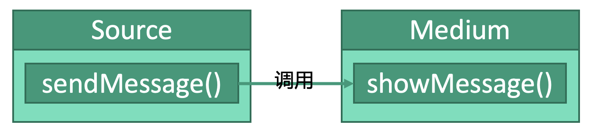

# 行为型：中介者模式


## 释义
中介者模式，在通信的两者间，增加一个中介类去处理通信问题，我们在通信时只需要维护中介类即可。


信源`Source`通过`sendMessage`发出的消息，通过调用中介类`Meduim`的`showMessage()`进行发送。


## 中介类
```kotlin
class Medium {
    companion object {
        fun showMessage(msg: String) {
            toShowMessage()
        }
    }
}
```

## 信源
```kotlin
class Source {
    fun sendMessage(msg: String) {
        // 调用中介类的方法完成通信
        Medium.showMessage(msg)
    }
}
```

## 使用
```kotlin
fun main() {
    val source: Source = Source()
    // 方法中会调用中介类的方法完成通信
    source.sendMessage("Message")
}
```
