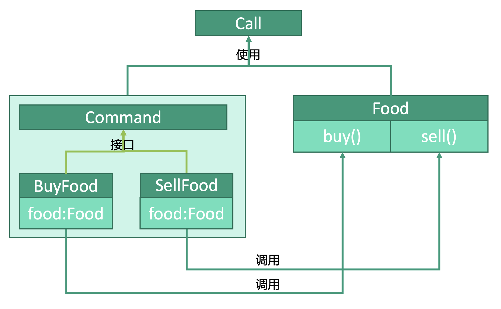

# 行为型：命令模式


## 释义
命令模式，将请求封装为命令类，传给调用类，调用类寻找合适的对象执行命令。

调用类`Call`，使用`Command`命令。将`BuyFood`和`SellFood`两条命令交给`Food`去执行，分别调用`Food`中的`buy()`和`sell()`。

## 命令
```kotlin
interface Command() {
    fun execute()
}

class BuyFood(val food: Food) {
    fun execute() { 
        food.buy() 
    }
}

class SellFood(val food: Food) {
    fun execute() { 
        food.sell()
    }
}
```

## 请求类
```kotlin
class Food {
    fun buy() { ... }
    fun sell() { ... }
}
```


## 调用类
```kotlin
class Call(
    // 创建一个命令队列
    val commands: MutableList<Command> =  mutableListOf<Command>()
) {
    // 向命令队列中新增命令
    fun addCommand(command: Command) {
        list.add(command)
    }
    
    // 执行命令
    fun executeCommand() {
        for(command in commands) {
            command.execute()
        }
    }
}
```

## 使用
```kotlin
fun main() {

    // 命令目标对象
    val food: Food = Food()
    // 命令
    val buyFood: BuyFood = BuyFood()
    val sellFood: SellFood = SellFood()
    // 命令调度器
    val call: Call = Call()
    
    // 添加命令
    call.addCommand(buyFood)
    call.addCommand(sellFood)
    // 执行命令
    call.executeCommand()
    
}
```
