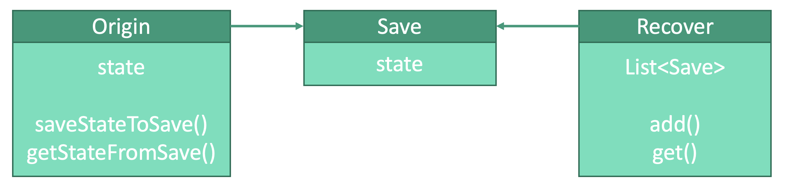

# 行为型：备忘录模式


## 释义
备忘录模式，存储对象状态，在需要时恢复。


基础类`Origin`将自身的状态打包成存储类`Save`存储到备忘录类`Recover`中。必要时，从`Recover`中获取`Save`来恢复`Origin`。

## 基础类
```kotlin
class Origin (
    var state: String
) {
    // 将状态存入Save中，存储时用
    fun saveStateToSave(): Save {
        return object : Save(this.state)
    }
    
    // 从Save中读取状态，恢复时用
    fun getStateFromSave(save: Save) {
        state = Save.state
    }
}
```

## 存储类
```kotlin
data class Save(
    var state
)
```

## 备忘录类
```kotlin
class Recover(
    // 存储Save的列表
    val saves: MutableList<Save> = mutableListOf()
) {
    fun add(save: Save) {
        saves.add(save)
    }
    
    fun get(index: Int): Save {
        return saves.get(index)
    }
}
```

## 使用
```kotlin
fun main() {
    val state: String = "state"
    val origin: Origin = Origin(state)
    val recover: Recover = Recover()
    
    // 存储状态
    recover.add(origin.saveStateToSave)
    
    // 恢复状态
    var index = 0
    origin.getStateFromSave(recover.get(index))
    
}
```
