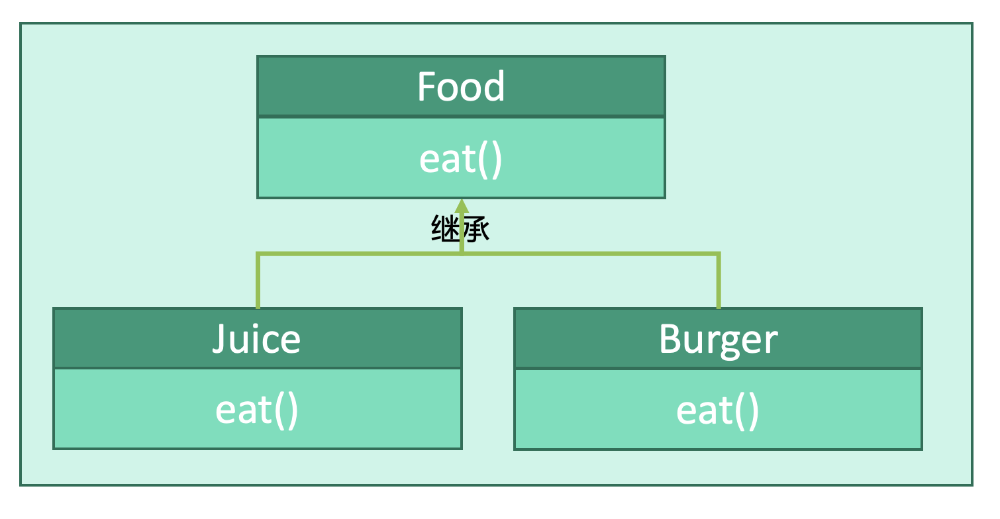

# 行为型：模板模式


## 释义
模板模式，模板为抽象类，子类继承模板，但是调用的时候调用的是模版的方法。


子类`Juice`和`Burger`继承模板类`Food`，调用时将以抽象类中定义的方式进行。即形式上不是`Juice.eat()`而是`Model.eat()`，实质上时`Juice.eat()`。


## 抽象类
```kotlin
abstract class Food {
    fun eat()
}
```

## 子类
```kotlin
class Juice : Food {
    fun eat() {
        println("drink juice")
    }
}

class Burger : Food {
    fun eat() {
        println("eat burger")
    }
}
```

## 使用
```kotlin
fun main() {
    val food1: Food = Juice()
    val food2: Food = Burger()
    
    // 形式上调用的是父类的方法，实际上会调用子类的方法
    food1.eat()
    food2.eat()
}
```
