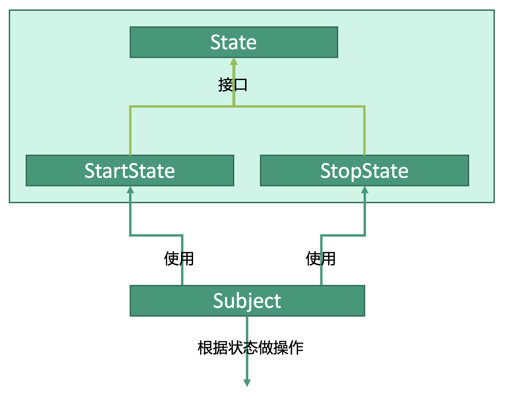

# 行为型：状态模式


## 释义
状态模式，多个状态类，将状态类传入主体类，主体类会随着状态类不同而做不同的操作。

两种状态`StartState`和`StopState`传给主体类`Subject`使用，主体类根据状态的不同会做不同的操作。

## 状态类
```kotlin
interface State {
    fun doAction(subject: Subject)
}

class StartState(
    var tag: String = "start"
) : State {
    // 将状态传给主体类
    fun doAction(subject: Subject) {
        subject.setState(this)
    }
}

class StopState(
    var tag: String = "stop"
) : State {
    // 将状态传给主体类
    fun doAction(subject: Subject) {
        subject.setState(this)
    }
}
```

## 主体类
```kotlin
class Subject(
    var state : State? = null
) {}
```

## 使用
```kotlin
fun main() {

    // 状态类
    val startState: StartState = StartState()
    val stopState: StopState = StopState()
    // 主体类
    val subject: Subject = Subject()
    
    // 为subject设置状态为StartState
    startState.doAction(subject)
    // 输出StartState中的tag
    println(subject.state.tag)
    
    // 为subject设置状态为StopState
    stopState.doAction(subject)
    // 输出StopState中的tag
    println(subject.state.tag)   
}
```
