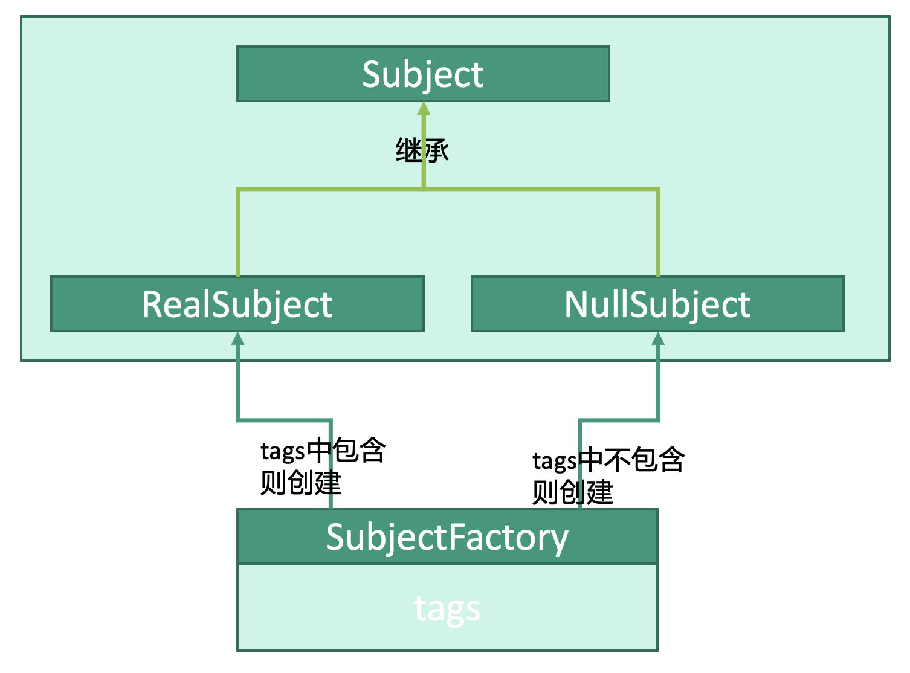

# 行为型：空对象模式


## 释义
空对象模式，用返回“空对象”而不是“判空”来应对“空”的情况。

工厂类`SubjectFactory`能够创建`Subject`，如果要求创建的对象的`tag`在工厂类的`tags`中，则创建实际对象`RealSubject`，否则创建空对象`NullSubject`。

## 抽象对象
```kotlin
abstract class AbstractSubject (
    var tag: String?
) {
    abstract fun isNull(): Boolean
}
```

## 实际对象
```kotlin
class RealSubject (
    var tag: String
): AbstractSubject(tag) {
    override fun isNull(): Boolean {
        return false
    }
}
```

## 空对象
```kotlin
class NullSubject: AbstractSubject("The Subject is null") {
    override fun isNull(): Boolean {
        return true
    }
}
```

## 工厂类
```kotlin
class SubjectFactory(
    val tags: MutableList<String> = mutableListOf()
) {
    fun getSubject(tag: String) {
        for(item in tags) {
            if(tag == item) {
                return object : RealSubject(tag)
            }
        }
        return object : NullSubject()
    }
}
```

## 使用
```kotlin
fun main() {
    // 构造工厂类
    val tags = mutableListOf("tag1","tag2","tag3")
    val subjectFactory: SubjectFactory = SubjectFactory(tags)
    
    // 从工厂类中获取对象
    // subject1、subject2、subject3拿到RealSubject
    val subject1 = subjectFactory.getSubject("tag1")
    val subject2 = subjectFactory.getSubject("tag2")
    val subject3 = subjectFactory.getSubject("tag3")
    // subject4拿到NullSubject
    val subject4 = subjectFactory.getSubject("tag4")
}
```


