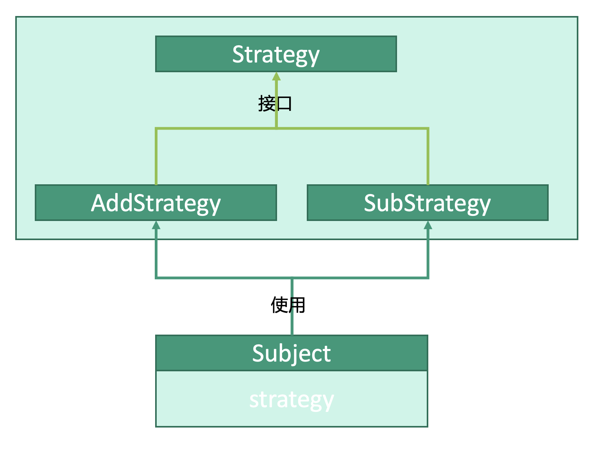

# 行为型：策略模式


## 释义
策略模式，制定多种策略，主体对象根据需要使用不同的策略。

主体类`Subject`中使用各种策略类`AddStrategy`、`SubStrategy`，按需执行策略类中的策略或更换策略。

## 策略类
```kotlin
interface Strategy {
    fun operation(param1: Int, param2: Int)
}

class AddStrategy : Strategy {
    override fun operation(param1: Int, param2: Int) {
        return param1+param2
    }
}

class SubStrategy : Strategy {
    override fun operation(param1: Int, param2: Int) {
        return param1-param2
    }
}
```

## 主体对象
```kotlin
class Subject(
    var strategy: Strategy
) {
    // 执行策略
    fun executeStrategy(param1: Int, param2: Int) {
        strategy.operation(param1, param2)
    }
}
```

## 使用
```kotlin
fun main() {
    // 参数
    val param1: Int = 1
    val param2: Int = 2
    // 策略类
    val addStrategy: AddStrategy = AddStrategy()
    val subStrategy: SubStrategy = SubStrategy()
    // 主体类
    val subject: Subject = Subject(addStrategy)
    
    // 执行策略
    subject.executeStrategy(param1, param2)
    // 更换策略
    subject.strategy = subStrategy
    // 执行新策略
    subject.executeStrategy(param1, param2)
    
}
```
