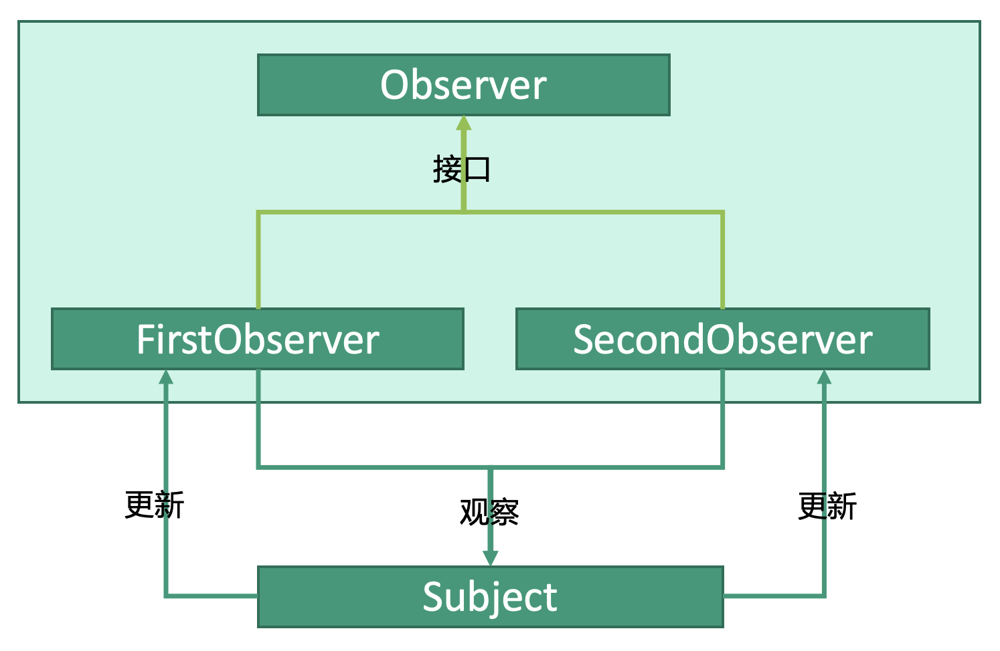

# 行为型：观察者模式


## 释义
观察者模式，观察者随着被观察者的变动而变动。


主体类`Subject`有两个观察者`FirstObserver`和`SecondObserver`。当`Subject`更新时，两个观察者会做出相应的更新。

## 观察者
```kotlin
interface Observer {
    fun update()
}

class FirstObserver(
    val subject: Subject
) {
    fun update() {
        // do update
    }
}

class SecondObserver(
    val subject: Subject
) {
    fun update() {
        // do update
    }
}
```

## 主体类
```kotlin
class Subject(
    val observers: MutableList<Observer> = mutableListOf(),
    val state: Int
) {

    // 添加观察者
    fun addObserver(observer: Observer) {
        this.attach(observer)
    }
    
    // 将观察者绑定到主体
    fun attach(observer: Observer) {
        observers.add(observer)
    }
    
    // 更新Subject内容时，相应的更新观察者
    fun setState(state: Int) {
        this.state = state
        notifyAllObserver()
    }
    
    fun notifyAllObserver() {
        for(observer in observers) {
            observer.update()
        }
    }
}
```

## 使用
```kotlin
fun main() {

    val fisrtObserver: Observer = FirstObserver()
    val secondObserver: Observer = SecondObserver()
    
    val subject: Subject = Subject(state = 0)
    
    // 绑定观察者
    subject.addObserver(firstObserver)
    subject.addObserver(secondOBserver)
    
    // 主体更新，观察者也会做相应的更新操作
    subject.setState(1)
}
```
