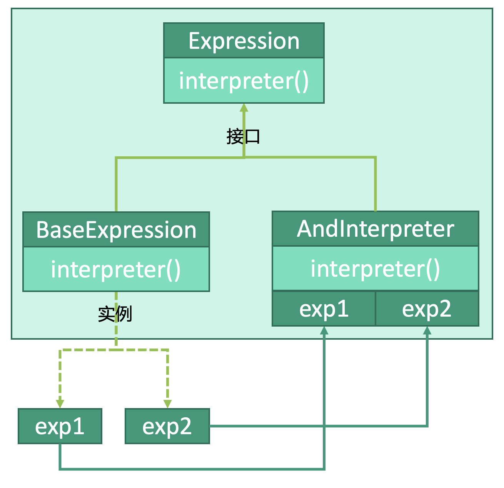

# 行为型：解释器模式


## 释义
解释器模式，通过解释器对内容进行解释。


表达式`Expression`由两个子类：
* 基础表达式`BaseExpression`
* 与解释器`AndInterpreter`

基础表达式的两个实例`exp1`和`exp2`传入与解释器，使用与解释器对`interpreter()`进行解释。

## 表达式
```kotlin
interface Expression {
    fun interpreter()
}
```

## 基础表达式
```kotlin
class BaseExpression() : Expression {
    override fun interpreter(context: String) {
        doInterpreter(context)
    }
}
```

## 解释器
```kotlin
class AndInterpreter(
    var String exp1,
    var String exp2
) {
    override fun interpreter() {
        // “与”
        exp1.interpreter()&&exp2.interpreter()
    }
}
```

## 使用
```kotlin
fun main() {
    // 创建基础表达式
    val exp1: Expression = BaseExpression("string1")
    val exp2: Expression = BaseExpression("string2")
    // 创建解释器
    val interpreter: AndInterpreter = AndInterpreter(exp1, exp2)
    // 解释
    interpreter.interpreter()
}
```
