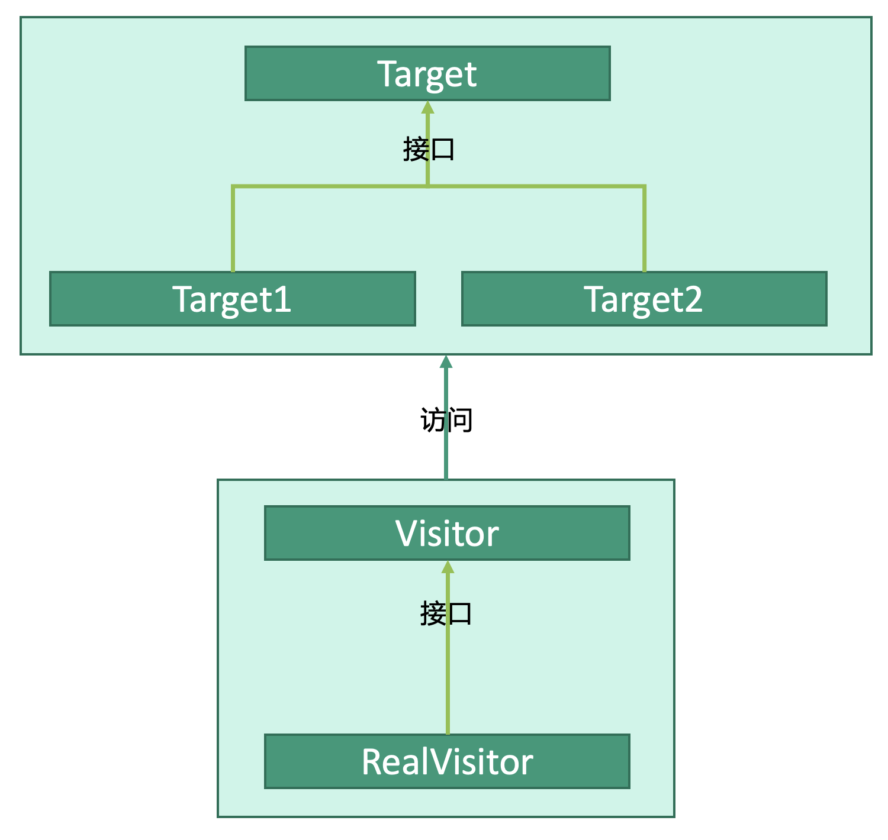

# 行为型：访问者模式


## 释义
访问者模式，访问者可以改变访问目标类执行的算法。

访问目标类`Target`有`Target1`、`Target2`两个目标，`Visitor`作为访问者分别访问两个目标，访问者会根据访问的目标执行不同的算法。


## 访问者
```kotlin
interface Visitor {
    visit(target1: Target1)
    visit(target2: Target2)
}

class RealVisitor : Visitor {
    override visit(target1: Target1) {
        // do somthing for target1
    }
    override visit(target2: Target2) {
        // do somthing for target2
    }
}
```

## 访问目标
```kotlin
interface Target {
    fun accept(visitor: Visitor)
}

class Target1: Target {
    fun accept(visitor: Visitor) {
        visitor.visit(this)
    }
}

class Target2: Target {
    fun accept(visitor: Visitor) {
        visitor.visit(this)
    }
}
```

## 使用
```kotlin
fun main() {
    // 访问目标
    val target1: Target = Target1()
    val target2: Target = Target2()
    // 访问者
    val realVisitor: RealVisitor = RealVisitor()
    
    // 开始访问
    // target1接受了访问者的访问，访问者执行了visit(target1: Target1）
    target1.accept(realVisitor)
    // target2接受了访问者的访问，访问者执行了visit(target2: Target2）
    target2.accept(realVisitor)
}
```
