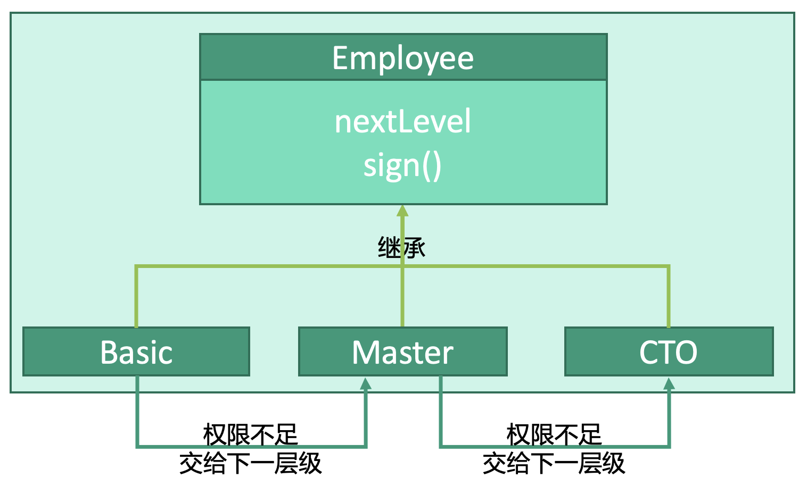

# 行为型：责任链模式


## 释义
责任链模式，如果你无法完成这项任务，就交给下一位，直到找到能负责这项任务的人。

一份文件需要雇员`Employee`签署`sign()`，雇员分为三个层级：
* 基层员工`Basic`
* 经理`Basic`
* 技术总监`CTO`

如果这一层级的员工权限不够，则交由下一层级`nextLevel`。
如果基层员工的权限不够，则将文件交由经理，如果经理的权限也不够，则交给技术总监。

## 雇员
```kotlin
open class Employee(
    var nextLevel: Employee?, // 下一层级的雇员
    var currentAuth: Int, // 当前层级的权限
    val BASIC: Int = 0x0, // 基础员工的权限
    val MASTER: Int = 0x1, // 经理的权限
    val CTO: Int = 0x2 // 技术总监的权限
) { 
    fun sign(targetAuth: Int) {
        // 有下一级，才继续传递
        if(nextLevel != null) { 
            if(currentAuth < targetAuth) {
                // 全下不够，交由下一层级
                nextLevel.sign(targetAuth)
            } else {
                // 权限足够则签署
                doSign()
            }
        } else {
            // 如果没有下一级，则已经到了最高级，直接签署
            doSign()
        }
    }
}
```

## 各层级雇员
```kotlin
class Basic(
    nextLevel: Master?,
    currentAuth: Employee.BASIC
) : Employee(nextLevel, currentAuth) {}

class Master(
    nextLevel: CTO?,
    currentAuth: Employee.MASTER
) : Employee(nextLevel, currentAuth) {}


class Master(
    nextLevel: null,
    currentAuth: Employee.CTO
) : Employee(nextLevel, currentAuth) {}
```

## 使用
```kotlin
fun main() {

    // 文件需要CTO签署
    val targetAuth: Int = Employee.CTO
    
    // cto为最高层级
    val cto: Employee = CTO()
    // master的下一级是cto
    val master: Employee = Master(cto)
    // basic的下一级是master
    val basic: Employee = Basic(basic)
    
    // basic的权限不够会传递给master，master权限不够会传递给cto，最终执行cto的sign()
    basic.sign(targetAuth) 
}
```


