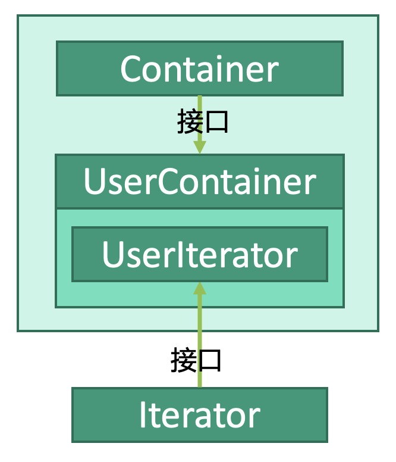

# 行为型：迭代器模式


## 释义
迭代器模式，迭代，即顺序访问对象集合。


迭代器容器`Container`用于获取迭代器`Iterator`。

## 迭代器
```kotlin
interface Iterator {
    fun hasNext(): Boolean
    fun next(): Object
}
```

## 迭代器容器
```kotlin
interface Container {
    fun getIterator(): Iterator
}

class UserContainer(
    val users: MutableList<String>
) {

    public fun getIterator(): Iterator {
        return object : UserIterator()
    }
    
    private class UserIterator(
        var index: Int = 0
    ): Iterator {
    
        override fun hasNext() {
            if(index < users.length) {
                return true
            }
            return false
        }
        
        override fun next(): String? {
            if(this.hasNext()){
                return users[index++];
            }
            return null;
        }
    }
}
```

## 使用
```kotlin
fun main() {
    // 创建数据源
    val users: MutableList<String> = mutableListOf(
        "名称1","名称2"
    )
    // 创建迭代器容器
    val container: Container = UserContainer(users)
    // 从容器中获取迭代器
    val iterator: Iterator = container.getIterator()
    
    // 迭代
    for(item in 0..users.size) {
        if(!iterator.hasNext()) {
            break;
        } else {
            iterator.next()
        }
    }    
}
```

