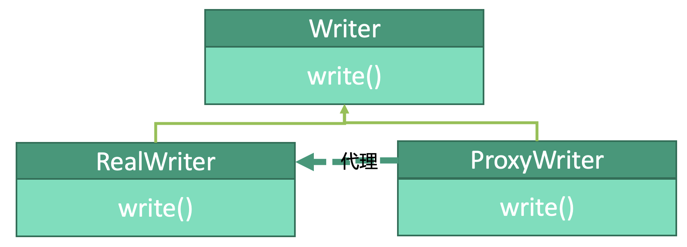

# 设计模式：代理模式


## 释义
代理模式，自己完不成的事交由另一位能完成的代理人去完成。

作家`Write`会写作`write()`。原作家`RealWriter`有一天需要请加，就请了一位代理作家`ProxyWriter`来完成自己当天的工作。

## 父类
```kotlin
interface Person {}
```

## 原作家
```kotlin
class RealWriter : Person {
    fun write() { ... }
}
```

## 代理作家
```kotlin
class ProxyWriter : Person(
    // 注意引入作家
    var writer: Writer
){
    // 调用原作家的方法
    fun write() { 
        writer.write() 
    }
}
```

## 使用
```kotlin
fun main() {
    val proxyWriter: ProxyWriter = ProxyWriter()
    proxyWriter.writer() // 由proxyWriter代为执行，实际上执行的是RealWriter的方法
}
```
