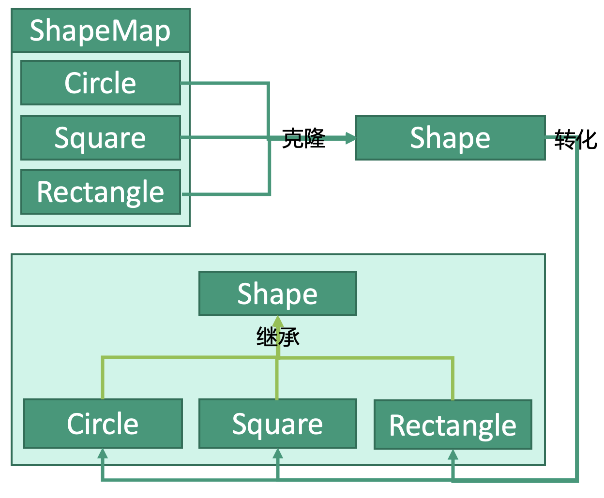

# 设计模式：原型模式


## 释义
原型模式，暂存一个原型，当需要创建该类的对象的时候（尤其是需要大量该类对象的时候），直接从这个原型复制一个对象出来而不是从头开始创建。



## 接入Cloneable
需要被克隆的类必须接上`Cloneable`，建议重写`clone`方法。
```kotlin
class Shape : Cloneable {
    open var name: String? = null

    public override fun clone(): Any? {
        var clone: Any? = null
        try {
            clone = super.clone()
        } catch (e: CloneNotSupportedException) {
            e.printStackTrace()
        }
        return clone
    }
}
```

## 子类
Circle
```kotlin
class Circle : Shape() {
    override var name = "Circle"
    
    ...
}
```

Square
```kotlin
class Square : Shape() {
    override var name = "Square"
    
    ...
}
```

Rectangle
```kotlin
class Rectangle : Shape() {
    override var name = "Rectangle"
    
    ...
}
```

## 存入ShapeMap
创建`ShapeCache`对象来存储ShapeMap
```kotlin
class ShapeCache {

    private var shapeMap: MutableMap<String, Shape> =  MutableMap<String, Shape>()

    // 向缓存中放入Shape
    fun loadCache(shape: Shape) {
        shapeMap?.set("name", shape)
    }
    
    fun getShape(name: String): Shape {
        return shapeMap.get(name)
    }
}
```


## 使用
```kotlin
fun main() {
    
    // 创建三个对象
    val circle: Circle = Circle()
    val square: Square = Square()
    val rectangle: Rectangle = Rectangle()
    
    // 创建缓存
    val shapeCache: ShapeCache = ShapeCache()
    
    // 将对象存入缓存
    shapeCache.loadCache(circle)
    shapeCache.loadCache(square)
    shapeCache.loadCache(rectangle)
    
    // 克隆
    val circleClone: Circle = shapeCache.get("circle").clone() as Circle
    val squareClone: Square = shapeCache.get("square").clone() as Square
    val rectangleClone: Rectangle = shapeCache.get("rectangle").clone() as Rectangle
}
```


