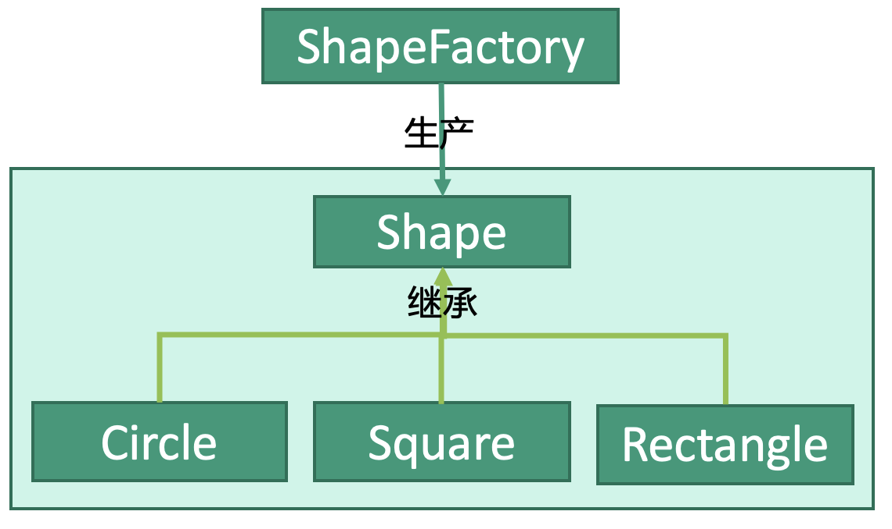

# 设计模式：工厂模式


## 释义
工厂模式，一个工厂可以生产一类产品，客户在订单中告诉工厂产品的具体要求，工厂为客户生产相应的产品。


这是一家生产磨具Shape的模具厂ShapeFactory，Shape包括Circle、Square、Rectangle三种形状。客户告诉模具厂自己想要的形状，模具厂就会为客户生产对应的形状。


### 产品类
```kotlin
interface Shape {}
```

### 产品子类
Circle
```kotlin
open class Circle : Shape {}
```

Square
```kotlin
open class Square : Shape {}
```

Rectangle
```kotlin
open class Rectangle : Shape {}
```

### 工厂
通过参数type告诉Factory我们需要的Shape类型。
```kotlin
class ShapeFactory {

    companion object {
        val CIRCLE = 0x0
        val SQUARE = 0x1
        val RECTANGLE = 0x2
    }
    
    // 传入type参数告诉工厂生产对应的Shape
    fun getShape(type: Int): Shape {
        when(type) {
            CIRCLE -> object : Circle()
            SQUARE -> object : Square()
            RECTANGLE -> object : Rectangle()
        }
    }
}
```

## 使用
```kotlin
fun main() {
    // 生产圆形模具Circle
    val shapeFactory: ShapeFactory = ShapeFactory()
    val circle: Circle = shapeFactory.getShape(ShapeFactory.CIRCLE)
    }
}
```
