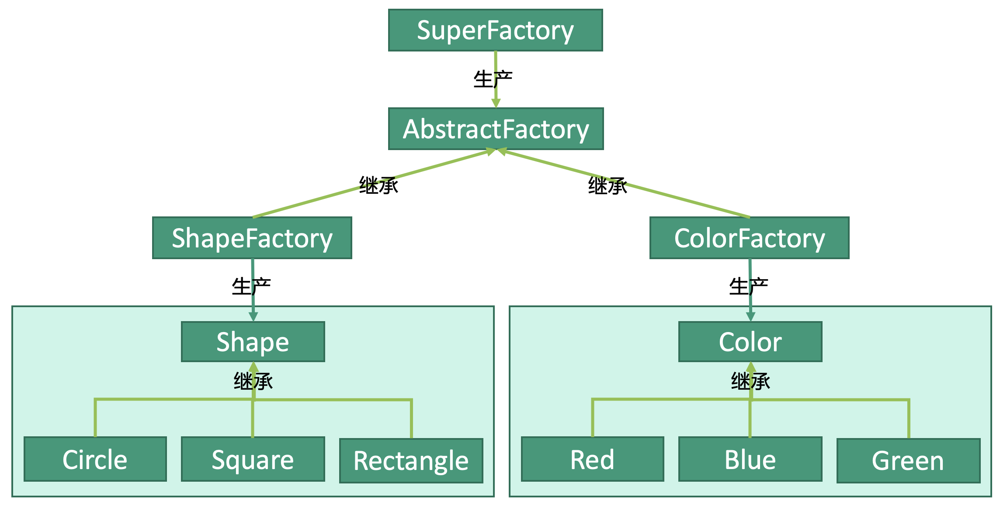

# 设计模式：抽象工厂模式


## 释义
抽象工厂模式，在工厂模式的基础上增加了一个能够生产工厂的超级工厂SuperFactory。抽象工厂AbstractFactory可以转变成模具厂ShapeFactory，也可以转变为颜料厂ColorFactory。
客户将订单交给超级工厂，超级工厂根据客户的需求，在抽象工厂的基础上建立模具厂或者颜料厂，并生产所需的产品。

这个超级工厂可以生产ShapeFactory和ColorFactory两种工厂，这些工厂再分别去生产各自的产品。


## 超级工厂
```kotlin
class SuperFactory {
    companion object {
        val COLOR: Int = 0x1
        val SHAPE: Int = 0x2
    }
    
    // 超级工厂根据type生产不同类型的工厂
    fun getFactory(type: Int) {
        when(type) {
            COLOR -> object : ColorFactory()
            SHAPE -> object : ShapeFactory()
        }
    }
}
```


## 抽象工厂
我们可以在抽象工厂的基础上建设模具厂或者颜料厂。
```kotlin
abstract class AbstractFactory {
    fun getShape(): Shape?
    fun getColor(): Color?
}
```

## 子工厂
```kotlin
// 变为模具厂
class ShapeFactory : AbstractFactory() {
    
    companion object {
        val CIRCLE = 0x0
        val SQUARE = 0x1
        val RECTANGLE = 0x2
    }
    
    override fun getShape(type: Int): Shape? {
        // 与工厂模式相同，根据客户提交的type生产所需的产品
        when(type) {
                CIRCLE -> object : Circle()
                SQUARE -> object : Square()
                RECTANGLE -> object : Rectangle()
        }
    }
    
    // 模具厂无法生产颜料
    override fun getColor(): Color? {
        return null
    }
}
```
颜料厂同理，不赘述。

## 使用
```kotlin
// 生产Circle
fun main() {
    val superFactory: SuperFactory = SuerpFactory()
    val circle: Circle = SuperFactory
        .getFactory(SuperFactory.SHAPE)
        .getShape(ShapeFactory.RED)
}
```


