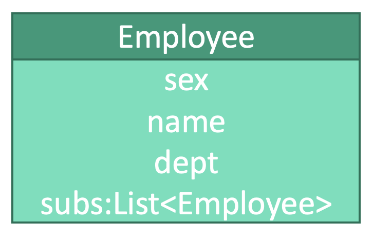

# 设计模式：组合模式


## 释义
组合模式，将结构相近的对象写为单一对象，并将这个对象作为树的节点类型，然后依据树形结构来构造对象。

职员信息具有相近的结构，包括性别sex、名称name、部门dept、下级subs，可以作为单一对象。我们运用下级subs

## 单一对象
```kotlin
class Employee (
    var sex: String
    var name: String
    var dept: String
    var subs: List<Employee> = List<Employee>()
) {
    fun addSub(sub: Employee) {
        subs.add(sub)
    }
}
```

## 使用
```kotlin
fun main() {
    // 创建雇员
    val ceo: Employee = Employee(
        sex = "男",
        name = "张三",
        dept = "总部"
    )
    val cto: Employee = Employee(
        sex = "男",
        name = "李四",
        dept = "总部"
    )
    val cfo: Employee = Employee(
        sex = "女",
        name = "王五",
        dept = "总部"
    )
    
    // 设置下级
    ceo.addSub(cto)
    ceo.addSub(cfo)
}
```

