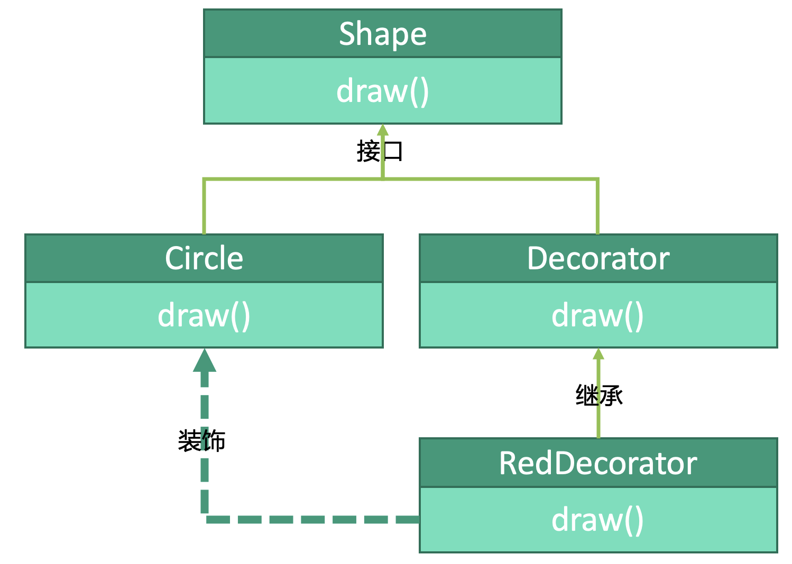

# 设计模式：装饰器模式


## 释义
装饰器模式，在原来的基础上再加一点点。

圆`Circle`和抽象装饰器`Decorator`都实现了图形`Shape`接口。圆`Circle`的`draw()`只能画出圆，我们可以用红色装饰器`RedDecorator`来为图形涂上红色：`RedDecorator`的`draw()`会在调用圆`Shape`的`draw()`的基础上再添加涂成红色的方法。

## 图形
```kotlin
interface Shape {
    fun draw()
}
```

## 圆
```kotlin
class Circle {
    override fun draw() {
        drawCircle()
    }
}
```

## 装饰器
```kotlin
abstract class Decorator(val shape: Shape): Shape {
    override fun draw() {
        shape.draw()
    }
}

class RedDecorator(shape: Shape): Shape(shape) { // Shape都可以
    override fun draw() {
        shape.draw() // 调用Shape的方法来画出图形
        drawRed(shape) // 把图形“装饰”成红色
    }
    
    // 涂成红色
    override fun drawRed() {
        ...
    }
}
```

## 使用
```kotlin
fun main() {
    val circle: Circle = Circle()
    // 被涂成红色的圆形
    val redCircle: Decorator = RedDecorator(circle)
    redCircle.draw() // 会调用RedDecorator中的draw()
}
```


