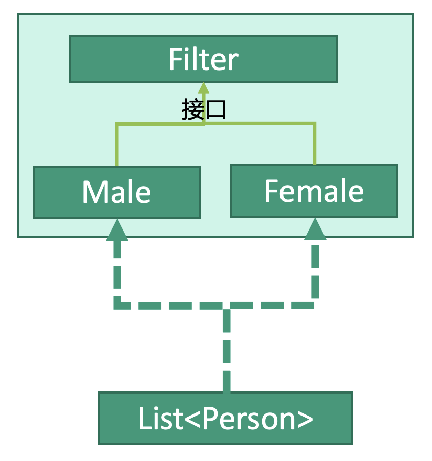

# 设计模式：过滤器模式


## 释义
过滤器模式，运用不同标准的过滤器筛选出数据。

`Male`和`Female`是两个过滤器，分别用于筛选男性和女性。`List<Person>`传入两个过滤器后，分别筛选出相应结果。

## 过滤器
```kotlin
interface Filter {
    fun filteBySex()
}

class Male : Filter {
    override fun filteBySex(persons: List<Person>): List<Person> {
        val men: List<Person> = List<Person>()
        for(person in persons) {
            if(person.isMale()) {
                men.add(person)
            } else {
                // do Nothing
            }
        }
        return men
    }
}

class Female : Filter {
    override fun filteBySex(persons: List<Person>): List<Person> {
        val women: List<Person> = List<Person>()
        for(person in persons) {
            if(person.isFemale()) {
                women.add(person)
            } else {
                // do Nothing
            }
        }
        return women
    }
}
```

## 使用
```kotlin
fun main() {
    // 初始化数据
    val persons: List<Persons> = List<Persons>
    persons.add(object : Person("male"))
    persons.add(object : Person("female"))
    ...
    persons.add(object : Person("female"))
    
    // 创建过滤器
    val male: Male = Male()
    
    // 过滤
    persons = Male().filteMale(persons)
}
```
