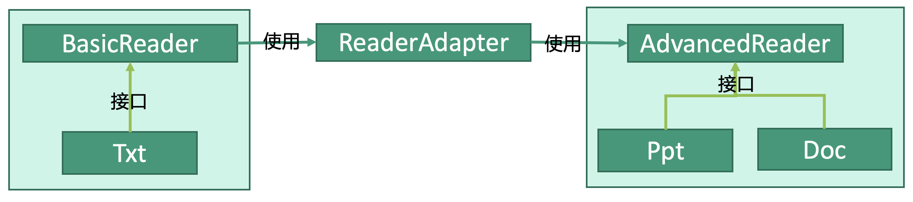

# 设计模式：适配器模式


## 释义
适配器模式，实现接口兼容。为对象增加一个适配器，使得其兼容原先无法使用的内容。

`BasicReader`只能读txt格式的文件，`AdvancedReader`能够读ppt格式和doc格式的文件。为了让`BasicReader`也能读ppt和doc，我们为其引入适配器`ReaderAdapter`，适配器中使用了`AdvancedReader`，因此`BasicReader`获得了读ppt和doc的能力，实现了对这两种格式的兼容。


## 被兼容
```kotlin
interface AdvancedReader {
    fun readPpt()
    fun readDoc()
}

class Ppt() {
    override fun readPpt() {
        toReadPpt()
    }
    
    override fun readDoc() {
        // do Nothing
    }
}

class Doc() { 
    override fun readPpt() {
        // do Nothing
    }
    
    override fun readDoc() {
        toReadDoc()
    }
}
```


## 适配器
```kotlin
class ReaderAdapter(
    val advancedReader: AdvancedReader
) {
    fun compatOpen(type: String) {
        when(type) {
            "ppt" -> advancedReader.readPpt()
            "doc" -> advanceReader.readDoc()
        }
    }
}
```
## 兼容
```kotlin
interface BasicReader {
    fun readTxt()
}

class Txt(readerAdapter: ReaderAdapter) : BasicReader {
    
    override fun readTxt() {
        toReadTxt()
    }
    
    fun compatRead(type: String) {
        when(type) {
            // 如果是txt就调用自身的方法
            "txt" -> readTxt()
            // 如果是ppt和doc就通过适配器调用advancedReader的方法
            "doc" -> readerAdapter
                .advancedReader
                .compatOpen(type)
            "ppt" -> readerAdapter
                .advancedReader
                .compatOpen(type)
        }
    }
}
```

## 使用
```kotlin
fun main() {

    doc: Doc = Doc()
    readerAdapter: ReaderAdapter = ReaderAdapter(doc)
    txt: Txt = Txt(readerAdapter)
    
    // txt兼容打开doc
    txt.compatOpen("doc")
}
```
